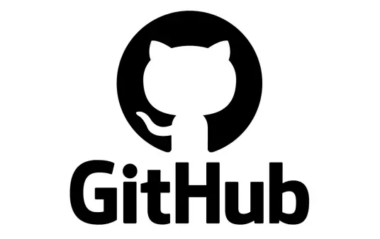

### **一、硬件检测与性能测试**
- **硬件信息与性能测试**：
- 鲁大师电脑版、图吧工具箱、电脑配置一键读取v2.0、AIDA64  

- **硬件辅助工具**：
- 360U盘鉴定器独立版、NTFS 驱动器保护、U盘权限设置工具、USBCopyer.Release  

### **二、系统文件备份与文件操作**
- **高速文件备份/复制**：
- Windows上最快的复制/备份软件fastcopy、文件极速拷贝工具FastCopy64、Fastcopy、备份恢复工具CGI-plus5.0.0.7x86_x64_自适应  

- **文件管理辅助**：
- 文件解锁工具_IObit Unlocker、IObit Unlocker、文件解锁工具IObitUnlocker、文件强删工具_Wise Force Delete  

- **批量文件处理**：
- 批量文件重命名Bulk_Rename_Utility、Bulk Rename、批量文件重命名Bulk Rename Utility  

- **文件同步与对比**：
- 文件同步freefilesync、Beyond Compare、BCompare文本文件对比工具  

- **文件查找与预览**：
- Everything、Everything文件快速搜索、Anytxt全文搜索工具、listary搜索和应用启动  

- **通用文件查看**：
- Universal File Viewer通用文件查看器、Universal Viewer 是一款适用于多种格式的高级文件查看器、万能文件查看器Viewer、QuickLook、QuickLook桌面快速预览、QQ截图提取版  

### **三、磁盘管理**
- **磁盘分区与管理**：
- DiskGenius、DiskGenius_Pro_v5.4.6.1441_x64_免安装PRO.exe、DiskGenius_Pro_v5.4.6.1441_x64_免安装PRO、DiskGenius_Pro_v5.4.6.1441_x86_免安装PRO、傲梅分区助手、分区助手  

- **磁盘空间分析**：
- 磁盘空间分析器(SpaceSniffer)1.3.0.2汉化版.exe、SpaceSniffer(磁盘空间分析工具)、磁盘空间分析器(SpaceSniffer)1.3.0.2汉化版、磁盘空间占用分析WizTree  

- **磁盘低级操作**：
- LLFTOOL磁盘低格、BOOTICE、BOOTICE_x64  

### **四、PE系统与重装工具**
- **PE启动盘制作**：
- 优启通EasyU 3.7.2023.1206_小鱼儿yr定制版、优启通EasyU_3.7.2023.1206、微PE工具箱、WePE_64_V2.3.iso、Ventoy、ventoy-1.0.89  

- **系统安装工具**：
- WinNTSetup-5.3-x64、WinToGo、Windows To Go优盘系统、MediaCreationTool22H2、系统离线工具.iso  

- **系统封装辅助**：
- 小鱼儿yr系统封装优化设置辅助工具2.11.8、小鱼儿yr系统封装优化设置辅助工具V2.11.4  

### **五、系统激活与版本调整**
- **系统激活**：
- HEU_KMS_Activator、HEU_KMS_Activator_v42.3.0  

- **系统版本转换**：
- Win10版本一键转换工具、Win10版本一键转换  

- **系统密钥与账户管理**：
- 查看系统密钥工具V2.90.1、windows 系统密码修改工具V2.27.1、Windows密码修改v1.6、NTPWEdit_x64、NTPWEdit_x86、快速用户管理器(Quick User Manager)2.2.0.0汉化版、系统新建账户工具  

### **六、系统安全设置**
- **Windows Defender管理**：
- Defender Control v2.1、windows-defender-remover、dControl.exe、一键禁用卸载Windows Defender1.1.exe、一键禁用卸载Windows Defender1.1、关闭微软安全中心.exe、关闭微软安全中心、Windows Defender开启关闭工具  

- **系统故障排查**：
- 蓝屏分析工具BlueScreenView、Lenovo Quick Fix 联想智能解决工具  

### **七、系统优化与维护**
- **系统精简与优化**：
- 系统精简工具(Dism++)、Dism++、optimizer、Optimizer系统优化工具、Windows优化工具、Windows 系统优化工具、最好的 Windows 优化器、Windows11轻松设置、Windows实用设置工具、删除 Windows 11 周围各个地方的广告的 GUI 工具  

- **隐私保护**：
- privatezilla隐私优化程序、Win隐私优化WPD_1.5.2042_Green、用户权限隐私OOSU10  

- **系统更新管理**：
- Windows 更新阻止程序、禁止系统更新工具  

- **系统清理与维护**：
- ccleaner清理优化、WiseCare365电脑管家、Windows超级管理器、软媒设置大师  

### **八、驱动管理**
- **驱动安装与更新**：
- 驱动精灵、驱动精灵标准版_v9.70.0.104_纯净版绿色单文件、360驱动大师 2.0.0.1760、EasyDrv7_Win10.x64_7.23.1221.1、Wise Driver Care 单文件版 v2.2.1106.1009_2  

- **特定硬件驱动**：
- 打印机驱动器LBP2900Plus_R150_V330_W64_ZH_1  

### **九、安全软件与卸载工具**
- **安全防护**：
- 火绒安全  

- **软件卸载**：
- HiBit Uninstaller 3.2.55.100、HiBit Uninstaller、HiBitUninstaller、HiBit卸载程序、Geek Uninstaller、Geek卸载程序  

### **十、网络配置与诊断**
- **DNS与网络优化**：
- DNS 服务器、DNS优选、360DNS优选、DNS Jumoer、DnsJumper、DnsTools 1.2.3绿色便携版、软媒魔方DNS  

- **网络诊断与修复**：
- 360LSP修复、360宽带测速器、360断网急救箱1、360断网急救箱2、吾爱破解论坛网络诊断修复工具 v2.5、联想网络修复工具V1.38.1  

- **网络监控与扫描**：
- 高级 IP 扫描器Advanced IP Scanner、网络扫描Advanced IP Scanner、网络扫描Nmap、局域网的在线设备情况mPing、Ping监视器(Ping Monster)1.9汉化版、无线网络监视器Homedale、端口专家PortExpert、IP地址查看工具V3.88.1、IP配置NetTool2.0、CopyIP、IP地址修改器  

- **网络代理与工具**：
- Clash.for.Windows.Setup.0.20.39.exe、ClashVergeRev、Netch、V2rayN、蓝灯  

- **hosts修改工具**：
- UsbEAm Hosts Editor多平台 hosts 修改  

### **十一、系统增强工具**
- **资源管理器增强**：
- QTTabBar ver 2048、QTTabBar资源管理器、QTTabBa  

- **系统功能扩展**：
- PowerToys (Preview) x64、PowerToys、Wintoys、EarTrumpet 是一套功能強大的 Windows 音量控制程式、EarTrumpet音量控制、WGestures 2 进阶的鼠标手势、全局鼠标手势WGestures、TranslucentTB  

- **右键菜单管理**：
- Windows右键菜单管理程序、ContextMenuManager（右键菜单管理工具）、ContextMenuManager.NET.3.5、ContextMenuManager右键管理器  

- **效率工具**：
- Wox、uTools效率工具、Quicker、Quicker工具箱  

- **剪贴板与快捷键**：
- 剪贴板管理器  

- **注册表与系统工具**：
- 高级注册表编辑器_RegCool  

### **十二、日常办公与基础工具**
- **文档处理**：
- WPS、PDF24 Creator(PDF工具箱)、PDF24、腾讯文档  

- **压缩与解压**：
- 360 Zip、Bandizip、7ZIP、7-Zip、UltraISO、软碟通_UltraISO 9.7.6.3860、PowerISO、WinRAR、360压缩国际版、7zSfxTool_v3.6.1.200、7zSFX_Constructor.dll、7zSFX_Constructor、Easy7z  

- **截图与录屏**：
- QQScreenShot、QQ截图提取版、ShareX、ShareX截图、verycapture截图、EV录屏、QQScreenShot 截图单文件  

- **下载工具**：
- Neat Download Manager 1.4.10、NDM、IDM、Internet Download Manager、迅雷、Aria2、Motrix、qBittorrent、Xdown、抖音采集工具  

- **看图与多媒体**：
- 2345看图王、PotPlayer、PotPlayer 64 bit、foobar2000音频播放器、listen1、lx-music、QQ音乐、网易云音乐、Fliqlo时钟屏保、格式工厂、图片工厂、美图秀秀、K-Lite_Codec_Pack编解码器  

- **思维导图与笔记**：
- XMind、留痕 - MemoTrace  

- **桌面管理**：
- 腾讯桌面  

### **十三、通信与社交工具**
- **企业协作**：
- 飞书、钉钉、企业微信、腾讯会议  

- **社交软件**：
- 微信、QQ、微信/QQ/TIM防撤回补丁、Telegram、Line、potato、telegram、Release 0.0.2 · tech-shrimp-WechatMoments、微信通讯录抽水机  

- **浏览器**：
- Google Chrome、GoogleChrome、Chrome浏览器、微软 Edge、Edge、FireFox火狐、Opera桌面浏览器、TorBrowser、Tor浏览器  

- **局域网传输**：
- LocalSend-1.14.0-windows-x86-64、局域网共享精灵  

### **十四、开发与编程工具**
- **代码编辑与IDE**：
- Notepad++、notepad++、Microsoft Visual Studio Code (User)、VS Code、Visual Studio Code、PyCharm Community Edition 2025.1.3、PyCharm、pycharm64、Dev-C++、Visual Studio、Java、Python、python、conda、Miniconda、EmEditor文本编辑器  

- **版本控制与协作**：
- Git、git、GitHub Desktop、GitHubDesktop、GithubDesktop汉化工具、GithubDesktopZhTool  

- **远程开发与文件传输**：
- MobaXterm-Chinese-Simplified、WinSCP、FileZilla、RealVNC Viewer、VNC-Viewer-6.22.315-Windows-64bit、局域网远程控制RealVNC  

- **容器与虚拟环境**：
- Docker Desktop、Windows Subsystem for Linux  

### **十五、专业软件与工业工具**
- **工业机器人与自动化**：
- DobotStudio Pro 4.6、越疆机器人DobotStudio Pro、ROBOGUIDE、FANUC ROBOGUIDE、FANUC.ROBOGUIDEV、ABB.RobotStudio、ABB.RobotWare、KUKA.OfficeLite KSS、KUKA.Sim、KUKA.WorkVisual、RoboDK、URSim、机器人杆长标定工具  

- **CAD与设计**：
- SOLIDWORK、SolidWorks2020、AutoCAD、中望CAD、浩辰CAD、Datakit3D文件格式转换、NX1980、今日制造、大工程师·、开拔网工具箱2024.04.07.rar、沐风工具箱5.2.0.10、迈迪工具集V6、MiniCADSee_X64、Proteus  

- **电气与PLC编程**：
- 西门子 博图TIA、STEP 7 MicroWIN SMART、TIA密钥、SIMATIC STEP 7 and WinCC V15.1 TRIAL、Eplan2.7、Keil单片机、modscan32、HslCommunicationDemo、HslCommunicationDemo读取PLC数据、HslCommunicationDemo-v11.7.0、边缘网关、SMART解密、RFID_Tool_v1.0.9.7RFID_Tool_v1.0.9.7、RFIDIP修改工具  

- **视觉与检测**：
- Cognex视觉、visionpro8、X-Sight Studio SV5  

- **数据恢复与存储**：
- 易我数据恢复、EasyRecovery数据恢复  

- **其他工业工具**：
- 多摩川、昆仑通态McgsPro、电工实物布线仿真教学、电工技能与实训仿真教学系统、EETBasicSetup_v1.3.0、EETPro_setup_v3.3.1、mes-robot20220726  

- **统计与分析**：
- SPSS、LabVIEW  

### **十六、虚拟机与系统仿真**
- **虚拟机工具**：
- VMware 工作站专业版、vmware、VM虚拟机、Ubuntu、Windows Subsystem for Linux  

### **十七、云存储与远程控制**
- **云存储工具**：
- 百度网盘、阿里云盘、阿里小白羊版、腾讯微云、夸克网盘、PikPak、PanDownload、AList 开源版  

- **远程控制**：
- 向日葵远程、ToDesk、RealVNC Viewer、局域网远程控制RealVNC  

### **十八、其他实用工具**
- **单文件制作工具**：
- Enigma Virtual Box v9.50、Enigmavb_v9.90.20211222_Chs、虚拟文件打包工具(Enigma Virtual Box)11.30.20250428汉化去广告版、单文件制作_x64、单文件制作_x86、单文件制作工具 7.0.2.3855_x64、单文件制作工具 7.0.2.3855_x86、单文件程序制作一键通、单文件程序制作一键通三合一_v5.15、简易封包工具_3.2.0.1、lua5.1.dll、lua51.dll、makesfx、APPS、APPS解压配置环境.txt、Easy7zHelp.chm  

- **系统运行库**：
- 微软.NET运行库合集、en_.net_framework_3.5_service_pack_1_x86_x64_ia64、微软VC++运行库合集、微软常用运行库合集v2021.07.15.1、微软常用运行库合集v2021.07.15、微软常用运行库合集v2021.08.02、微软常用运行库合集v2023.02.02、微软常用运行库合集v2023.02.22  

- **手机相关工具**：
- 爱思助手8、爱思助手、iTunes、iOS旧版应用下载v5.1、安卓玩机工具箱、搞机助手_V4.7.3  

- **系统工具箱**：
- 系统维护工具箱、超级工具箱、路遥工具箱、FixWin 11.1、小米电脑管家、联想电脑管家、系统工具箱  

- **图标与美化**：
- 图标提取转换器 Quick Any2Ico、Quick Any2Ico、枫の主题社、DP美化、MoeW10、MoeW11  

- **其他小工具**：
- 简易封包工具_3.2.0.1、文件校验工具、重复文件查找、重复文件查找DupFilesSearchAndLink、文件夹移动FolderMove、文件格式查看器FileViewPro、快捷方式删除工具MyComputerManager_v1.03_64bit、MyComputerManager、Adobe Flash Player 34.0.0.308_三合一特别版、Adobe Flash Player 三合一特别版、Flash、ChatGPT、ChatGPT、Wireshark、Advanced Installer、chfsgui、wordwxcel转图片、压缩包转图片、NetDisabler一键网络禁用器、禁止软件联网Firewall App Blocker、防火墙工具FortFirewall、系统服务工具Eso、UniGetUI、WingetUI 软件管理器、amcap+v3.0.9、kemotion、专利业务办理系统客户端、未来教育考试系统、工业机器人应用编程安全教育与测评系统、词达人、音标点读、人脸活体检测、AI 0x0、EasyConnectInstaller、文墨天机、策天飞星、连山易排盘  

### **十九、娱乐与杂项**
- **游戏与娱乐**：
- 原神、Steam、SteamSetup、夜神模拟器  

- **影音编辑**：
- 剪映

### **拓展脚本下载**  

<table>
  <tr>
    <td style="text-align: center;">
      <a href="https://microsoftedge.microsoft.com/addons/Microsoft-Edge-Extensions-Home?hl=zh-CN">
        
         
        Edge 扩展
      </a>
    </td>
  <td style="text-align: center;">
      <a href="https://chromewebstore.google.com/?hl=zh-CN&utm_source=ext_sidebar">
        
         
        Chrome 应用商店
      </a>
    </td>
  <td style="text-align: center;">
      <a href="https://www.crxsoso.com/">
        
         
        Crx搜搜
      </a>
    </td>
  </tr>
</table>

### **一、广告拦截与去广告工具**  

<table>
  <tr>
  <td style="text-align: center;">
      <a href="https://microsoftedge.microsoft.com/addons/detail/adblock-plus-%E5%85%8D%E8%B4%B9%E7%9A%84%E5%B9%BF%E5%91%8A%E6%8B%A6%E6%88%AA%E5%99%A8/gmgoamodcdcjnbaobigkjelfplakmdhh">
        
         
        Adblock Plus
      </a>
    </td>
    <td style="text-align: center;">
      <a href="https://microsoftedge.microsoft.com/addons/detail/adguard-%E5%B9%BF%E5%91%8A%E6%8B%A6%E6%88%AA%E5%99%A8/pdffkfellgipmhklpdmokmckkkfcopbh">
        
         
        AdGuard
      </a>
  </tr>
</table>

### **四、翻译工具**  

<table>
  <tr>
  <td style="text-align: center;">
      <a href="https://microsoftedge.microsoft.com/addons/detail/%E6%B2%89%E6%B5%B8%E5%BC%8F%E7%BF%BB%E8%AF%91-%E7%BD%91%E9%A1%B5%E7%BF%BB%E8%AF%91%E6%8F%92%E4%BB%B6-pdf%E7%BF%BB%E8%AF%91-/amkbmndfnliijdhojkpoglbnaaahippg">
        
         
        沉浸式翻译
      </a>
    </td>
    <td style="text-align: center;">
      <a href="https://microsoftedge.microsoft.com/addons/detail/%E5%88%92%E8%AF%8D%E7%BF%BB%E8%AF%91/oikmahiipjniocckomdccmplodldodja">
        
         
        划词翻译
      </a>
    </td>
  </tr>
</table>

- **显示优化**：  

<table>
  <tr>
  <td style="text-align: center;">
      <a href="https://chromewebstore.google.com/detail/dark-reader/eimadpbcbfnmbkopoojfekhnkhdbieeh">
        
         
        暗色模式
      </a>
    </td>
        <td style="text-align: center;">
      <a href="https://www.youxiaohou.com/tool/install-darkmode.html">
        
         
        夜间模式助手
      </a>
    </td>
    <td style="text-align: center;">
      <a href="https://greasyfork.org/zh-CN/scripts/426377-dark-mode">
        
         
        护眼模式
      </a>
    </td>
  </tr>
</table>

### **截图工具**  

<table>
  <tr>
  <td style="text-align: center;">
      <a href="https://microsoftedge.microsoft.com/addons/detail/%E6%8D%95%E6%8D%89%E7%BD%91%E9%A1%B5%E6%88%AA%E5%9B%BE-fireshot%E7%9A%84/fcbmiimfkmkkkffjlopcpdlgclncnknm">
        
         
        捕捉网页截图
      </a>
    </td>
      <td style="text-align: center;">
      <a href="https://microsoftedge.microsoft.com/addons/detail/%E8%8D%89%E6%96%99%E4%BA%8C%E7%BB%B4%E7%A0%81%E5%BF%AB%E9%80%9F%E7%94%9F%E7%A0%81%E5%92%8C%E8%A7%A3%E7%A0%81%E5%B7%A5%E5%85%B7/dkbiiofameebehokbgjmdcholafphbnl?hl=zh-CN">
        
         
        草料二维码
      </a>
    </td>
  <td style="text-align: center;">
      <a href="https://microsoftedge.microsoft.com/addons/detail/scroll-to-top-button/dobeplcigkjlbajngcgnndecohjkjmia">
        
         
        回到顶部
      </a>
    </td>
    <td style="text-align: center;">
      <a href="https://chromewebstore.google.com/detail/global-speed/jpbjcnkcffbooppibceonlgknpkniiff">
        
         
        视频速度调节
      </a>
    </td>
    <td style="text-align: center;">
      <a href="https://microsoftedge.microsoft.com/addons/detail/%E6%89%A9%E5%B1%95%E7%AE%A1%E7%90%86%E5%99%A8/nfcpcmdnnjjchholfbcoaejiilnpgcmk">
        
         
        扩展管理器
      </a>
    </td>
    <td style="text-align: center;">
      <a href="https://greasyfork.org/zh-CN/scripts/372673-%E8%AE%A1%E6%97%B6%E5%99%A8%E6%8E%8C%E6%8E%A7%E8%80%85-%E8%A7%86%E9%A2%91%E5%B9%BF%E5%91%8A%E8%B7%B3%E8%BF%87-%E8%A7%86%E9%A2%91%E5%B9%BF%E5%91%8A%E5%8A%A0%E9%80%9F%E5%99%A8">
        
         
        计时器掌控者
      </a>
    </td>
    <td style="text-align: center;">
      <a href="https://greasyfork.org/zh-CN/scripts/24204-picviewer-ce">
        
         
        在线看图工具
      </a>
    </td>
  </tr>
</table>

### **拓展脚本管理**  

<table>
  <tr>
  <td style="text-align: center;">
      <a href="https://microsoftedge.microsoft.com/addons/detail/%E7%AF%A1%E6%94%B9%E7%8C%B4/iikmkjmpaadaobahmlepeloendndfphd">
        
         
        篡改猴
      </a>
    </td>
        <td style="text-align: center;">
      <a href="https://greasyfork.org/zh-CN">
        
         
        Greasy Fork论坛
      </a>
    </td>
    <td style="text-align: center;">
      <a href="https://microsoftedge.microsoft.com/addons/detail/%E8%84%9A%E6%9C%AC%E7%8C%AB/liilgpjgabokdklappibcjfablkpcekh">
        
         
        脚本猫
      </a>
    </td>
        <td style="text-align: center;">
      <a href="https://scriptcat.org/zh-CN/search">
        
         
        脚本猫论坛
      </a>
    </td>
  </tr>
</table>

### **Greasy Fork**  

<table>
  <tr>
  <td style="text-align: center;">
      <a href="https://greasyfork.org/zh-CN/scripts/412956-greasyfork%E4%BC%98%E5%8C%96%E5%B7%A5%E5%85%B7-%E5%8C%85%E5%90%AB%E6%97%B6%E5%8C%BA%E8%BD%AC%E6%8D%A2-%E6%97%B6%E9%97%B4%E6%A0%BC%E5%BC%8F%E5%8C%96-%E4%B8%80%E9%94%AE%E5%A4%8D%E5%88%B6%E4%BB%A3%E7%A0%81-%E4%B8%80%E9%94%AE%E6%9F%A5%E7%9C%8B%E4%BB%A3%E7%A0%81-%E8%AE%BA%E5%9D%9B%E9%BB%98%E8%AE%A4%E6%98%BE%E7%A4%BA%E9%97%AE%E7%AD%94%E7%89%88%E5%9D%97%E8%80%8C%E4%B8%8D%E6%98%AF%E8%84%9A%E6%9C%AC%E5%8F%8D%E9%A6%88%E7%AD%89">
        
         
        GreasyFork优化工具
      </a>
    </td>
  <td style="text-align: center;">
      <a href="https://greasyfork.org/zh-CN/scripts/393396-greasyfork-helper">
        
         
        GreasyFork网站助手
      </a>
    </td>
        <td style="text-align: center;">
      <a href="https://greasyfork.org/zh-CN/scripts/412611-newscript-%E6%96%B0%E8%84%9A%E6%9C%AC%E9%80%9A%E7%9F%A5-%E4%B8%8D%E9%94%99%E8%BF%87%E4%BB%BB%E4%BD%95%E4%B8%80%E4%B8%AA%E5%A5%BD%E8%84%9A%E6%9C%AC">
        
         
        新脚本通知
      </a>
    </td>
      <td style="text-align: center;">
      <a href="https://greasyfork.org/zh-CN/scripts/23840-greasyfork-search-with-sleazyfork-results-include">
        
         
        大人的Greasyfork
      </a>
    </td>
  </tr>
</table>

### **自动翻页**  

<table>
  <tr>
  <td style="text-align: center;">
      <a href="https://greasyfork.org/zh-CN/scripts/438684-pagetual">
        
         
        东方永页机
      </a>
    </td>
      <td style="text-align: center;">
      <a href="https://greasyfork.org/zh-CN/scripts/438656-%E8%87%AA%E5%8A%A8%E5%B1%95%E5%BC%80">
        
         
        自动展开
      </a>
    </td>
  <td style="text-align: center;">
      <a href="https://greasyfork.org/zh-CN/scripts/419215-autopager">
        
         
        自动无缝翻页
      </a>
    </td>
  <td style="text-align: center;">
      <a href="https://greasyfork.org/zh-CN/scripts/389621-%E9%A1%B5%E9%9D%A2%E8%87%AA%E5%8A%A8%E6%8B%BC%E6%8E%A5">
        
         
        页面自动拼接
      </a>
    </td>
  </tr>
</table>

#### **1、解除网页限制**：  

<table>
  <tr>
    <td style="text-align: center;">
      <a href="https://github.com/rxliuli/userjs/blob/master/apps/unblock-web-restrictions/README.zhCN.md">
        
         
        解除网页限制
      </a>
    </td>
    <td style="text-align: center;">
      <a href="https://www.youxiaohou.com/tool/bookmark.html#%F0%9F%94%8D-crx%E6%90%9C%E6%90%9C-%E4%BB%BB%E6%84%8F%E9%A1%B5%E9%9D%A2%E6%90%9C%E7%B4%A2%E6%89%A9%E5%B1%95">
        
         
        超级书签
      </a>
    </td>
    <td style="text-align: center;">
      <a href="https://cat7373.github.io/remove-web-limits/">
        
         
        网页限制解除
      </a>
    </td>
    <td style="text-align: center;">
      <a href="https://greasyfork.org/zh-CN/scripts/405130-%E6%96%87%E6%9C%AC%E9%80%89%E4%B8%AD%E5%A4%8D%E5%88%B6">
        
         
        文本选中复制
      </a>
    </td>
  </tr>
</table>

<table>
  <tr>
        <td style="text-align: center;">
      <a href="https://greasyfork.org/zh-CN/scripts/443670-%E9%93%BE%E6%8E%A5%E7%AE%A1%E7%90%86">
        
         
        链接管理
      </a>
    </td>
    <td style="text-align: center;">
      <a href="https://greasyfork.org/zh-CN/scripts/27752-searchenginejump-%E6%90%9C%E7%B4%A2%E5%BC%95%E6%93%8E%E5%BF%AB%E6%8D%B7%E8%B7%B3%E8%BD%AC">
        
         
        搜索引擎快捷跳转
      </a>
    </td>
    <td style="text-align: center;">
      <a href="https://greasyfork.org/zh-CN/scripts/416338-redirect-%E5%A4%96%E9%93%BE%E8%B7%B3%E8%BD%AC">
        
         
        redirect 外链跳转
      </a>
    </td>
  </tr>
</table>

<table>
  <tr>
    <td style="text-align: center;">
      <a href="https://www.youxiaohou.com/tool/install-starpassword.html">
        
         
        星号密码显示助手
      </a>
    </td>
    <td style="text-align: center;">
      <a href="https://greasyfork.org/zh-CN/scripts/418942-%E4%B8%87%E8%83%BD%E9%AA%8C%E8%AF%81%E7%A0%81%E8%87%AA%E5%8A%A8%E8%BE%93%E5%85%A5-%E5%8D%87%E7%BA%A7%E7%89%88">
        
         
        万能验证码自动输入
      </a>
    </td>
  </tr>
</table>

- **网盘识别**：  

<table>
  <tr>
  <td style="text-align: center;">
      <a href="https://www.youxiaohou.com/tool/install-panai.html">
        
         
        网盘智能识别助手
      </a>
    </td>
    <td style="text-align: center;">
      <a href="https://scriptcat.org/zh-CN/script-show-page/373">
        
         
        网盘自动填写访问码
      </a>
    </td>
  
  <td style="text-align: center;">
      <a href="https://greasyfork.org/zh-CN/scripts/416915-%E7%BD%91%E7%9B%98%E7%B2%BE%E7%81%B5">
        
         
        网盘精灵
      </a>
    </td>
    <td style="text-align: center;">
      <a href="https://greasyfork.org/zh-CN/scripts/419224-%E8%93%9D%E5%A5%8F%E4%BA%91%E7%BD%91%E7%9B%98%E5%A2%9E%E5%BC%BA">
        
         
        蓝奏云网盘增强
      </a>
    </td>
  </tr>
</table>

- **网盘下载**：  

<table>
  <tr>
      <td style="text-align: center;">
      <a href="https://www.youxiaohou.com/install.html#%F0%9F%93%96-%E4%BD%BF%E7%94%A8%E6%95%99%E7%A8%8B">
        
         
        网盘直链下载助手
      </a>
    </td>
  <td style="text-align: center;">
      <a href="https://greasyfork.org/zh-CN/scripts/449291-linkswift">
        
         
        网盘直链下载助手
      </a>
    </td>
<td style="text-align: center;">
      <a href="https://greasyfork.org/zh-CN/scripts/22590-easy-offline">
        
         
        全载
      </a>
    </td>
<td style="text-align: center;">
      <a href="https://greasyfork.org/zh-CN/scripts/465078-tt%E5%8A%A9%E6%89%8B-%E7%99%BE%E5%BA%A6%E7%BD%91%E7%9B%98%E5%B7%A5%E5%85%B7%E7%AE%B1%E7%9B%B4%E9%93%BE%E8%A7%A3%E6%9E%90-%E6%8C%81%E7%BB%AD%E6%9B%B4%E6%96%B0">
        
         
        TT助手
      </a>
    </td>
    <td style="text-align: center;">
      <a href="https://greasyfork.org/zh-CN/scripts/431256-%E8%BF%85%E9%9B%B7%E4%BA%91%E7%9B%98">
        
         
        迅雷云盘
      </a>
    </td>
    <td style="text-align: center;">
      <a href="https://greasyfork.org/zh-CN/scripts/432415-onedrive-%E6%96%87%E4%BB%B6%E4%B8%8B%E8%BD%BD%E7%9B%B4%E9%93%BE">
        
         
        OneDrive 文件下载直链
      </a>
    </td>
  </tr>
</table>

- **下载辅助**：  

<table>
  <tr>
      <td style="text-align: center;">
      <a href="https://microsoftedge.microsoft.com/addons/detail/%E7%8C%AB%E6%8A%93/oohmdefbjalncfplafanlagojlakmjci">
        
         
        猫抓
      </a>
    </td>
    <td style="text-align: center;">
      <a href="https://chromewebstore.google.com/detail/aria2-explorer/mpkodccbngfoacfalldjimigbofkhgjn?pli=1">
        
         
        Aria2 Explorer
      </a>
    </td>
      <td style="text-align: center;">
      <a href="https://greasyfork.org/zh-CN/scripts/380918-%E4%B8%8B%E8%BD%BD%E5%8D%AB%E5%A3%AB">
        
         
        下载卫士
      </a>
    </td>
  </tr>
</table>

### **Github脚本**  

<table>
  <tr>
    <td style="text-align: center;">
      <a href="https://microsoftedge.microsoft.com/addons/detail/github%E5%8A%A0%E9%80%9F/alhnbdjjbokpmilgemopoomnldpejihb">
        
         
        GitHub加速
      </a>
    </td>
    <td style="text-align: center;">
      <a href="https://microsoftedge.microsoft.com/addons/detail/githubcn/onlodfoebaobhmlhgcbddjngjbkdbfaj">
        
         
        GithubCN
      </a>
    </td>
        <td style="text-align: center;">
      <a href="https://greasyfork.org/zh-CN/scripts/412245-github-enhancement-high-speed-download">
        
         
        Github 增强
      </a>
    </td> 
  <td style="text-align: center;">
      <a href="https://greasyfork.org/zh-CN/scripts/398278-github-%E9%95%9C%E5%83%8F%E8%AE%BF%E9%97%AE-%E5%8A%A0%E9%80%9F%E4%B8%8B%E8%BD%BD">
        
         
        Github 镜像访问
      </a>
    </td>
  <td style="text-align: center;">
      <a href="https://greasyfork.org/zh-CN/scripts/435208-github-%E4%B8%AD%E6%96%87%E5%8C%96%E6%8F%92%E4%BB%B6">
        
         
        GitHub 中文化插件
      </a>
    </td>  
     <td style="text-align: center;">
      <a href="https://greasyfork.org/zh-CN/scripts/407485-github-internationalization">
        
         
        GitHub汉化插件
      </a>
    </td>
  </tr>
</table>

## **其他脚本** 

<table>
  <tr>
    </td>
      <td style="text-align: center;">
      <a href="https://greasyfork.org/zh-CN/scripts/440871-%E9%AA%9A%E6%89%B0%E6%8B%A6%E6%88%AA">
        
         
        骚扰拦截
      </a>
    </td>
      <td style="text-align: center;">
      <a href="https://greasyfork.org/zh-CN/scripts/428960-csdn-%E7%9F%A5%E4%B9%8E-%E5%93%94%E5%93%A9%E5%93%94%E5%93%A9-%E7%AE%80%E4%B9%A6%E5%85%8D%E7%99%BB%E5%BD%95%E5%8E%BB%E9%99%A4%E5%BC%B9%E7%AA%97%E5%B9%BF%E5%91%8A">
        
         
        登录个锤子
      </a>
    </td> 
    <td style="text-align: center;">
      <a href="https://greasyfork.org/zh-CN/scripts/430118-%E5%BE%AE%E5%8D%9A%E5%85%8D%E7%99%BB%E9%99%86%E6%9F%A5%E7%9C%8B%E5%85%A8%E6%96%87-csdn%E5%85%8D%E5%85%B3%E6%B3%A8%E5%B1%95%E7%A4%BA%E5%85%A8%E6%96%87">
        
         
        查看全文
      </a>
    </td>
  </tr>
</table>

### **百度脚本**  
<table>
  <tr>
<td style="text-align: center;">
      <a href="https://greasyfork.org/zh-CN/scripts/394099-%E7%99%BE%E5%BA%A6%E7%B3%BB%E7%BD%91%E7%AB%99%E5%8E%BB%E5%B9%BF%E5%91%8A">
        
         
        百度系网站去广告
      </a>
    </td>
    <td style="text-align: center;">
      <a href="https://greasyfork.org/zh-CN/scripts/24192-%E7%99%BE%E5%BA%A6%E5%B9%BF%E5%91%8A-%E9%A6%96%E5%B0%BE%E6%8E%A8%E5%B9%BF%E5%8F%8A%E5%8F%B3%E4%BE%A7%E5%B9%BF%E5%91%8A-%E6%B8%85%E7%90%86">
        
         
        百度广告清理
      </a>
    </td>
  <td style="text-align: center;">
      <a href="https://greasyfork.org/zh-CN/scripts/24171-kill-tieba-ad">
        
         
        贴吧广告清理
      </a>
    </td>
  </tr>
</table>

### **CSDN脚本**  
<table>
  <tr>
      <td style="text-align: center;">
      <a href="https://greasyfork.org/zh-CN/scripts/411919-csdn%E5%85%8D%E7%99%BB%E5%BD%95%E5%A4%8D%E5%88%B6">
        
         
        CSDN免登录复制
      </a>
    </td>
  <td style="text-align: center;">
      <a href="https://greasyfork.org/zh-CN/scripts/378351-csdngreener-csdn%E5%B9%BF%E5%91%8A%E5%AE%8C%E5%85%A8%E8%BF%87%E6%BB%A4-%E5%85%8D%E7%99%BB%E5%BD%95-%E4%B8%AA%E6%80%A7%E5%8C%96%E6%8E%92%E7%89%88-%E6%9C%80%E5%BC%BA%E8%80%81%E7%89%8C%E8%84%9A%E6%9C%AC-%E6%8C%81%E7%BB%AD%E6%9B%B4%E6%96%B0">
        
         
        CSDN广告完全过滤
      </a>
    </td>
    <td style="text-align: center;">
      <a href="https://greasyfork.org/zh-CN/scripts/373457-csdn-%E5%8E%BB%E5%B9%BF%E5%91%8A%E6%B2%89%E6%B5%B8%E9%98%85%E8%AF%BB%E6%A8%A1%E5%BC%8F">
        
         
        CSDN 去广告沉浸阅读模式
      </a>
    </td>
  </tr>
</table>

### **知乎脚本**  

<table>
  <tr>
  <td style="text-align: center;">
      <a href="https://greasyfork.org/zh-CN/scripts/419081-zhihu-enhancement">
        
         
        知乎增强
      </a>
    </td>
    <td style="text-align: center;">
      <a href="https://greasyfork.org/zh-CN/scripts/412212-%E7%9F%A5%E4%B9%8E%E7%BE%8E%E5%8C%96">
        
         
        知乎美化
      </a>
    </td>
  </tr>
</table>

### **吾爱破解论坛脚本**  

<table>
  <tr>
  <td style="text-align: center;">
      <a href="https://greasyfork.org/zh-CN/scripts/412680-%E5%90%BE%E7%88%B1%E7%A0%B4%E8%A7%A3%E8%AE%BA%E5%9D%9B%E5%A2%9E%E5%BC%BA-%E8%87%AA%E5%8A%A8%E7%AD%BE%E5%88%B0-%E7%BF%BB%E9%A1%B5">
        
         
        吾爱破解论坛增强
      </a>
    </td>
  <td style="text-align: center;">
      <a href="https://greasyfork.org/zh-CN/scripts/412681-%E5%90%BE%E7%88%B1%E7%A0%B4%E8%A7%A3%E8%AE%BA%E5%9D%9B%E7%BE%8E%E5%8C%96">
        
         
        吾爱破解论坛美化
      </a>
    </td>
  </tr>
</table>

### **哔哩哔哩脚本**  

<table>
  <tr>
<td style="text-align: center;">
      <a href="https://github.com/the1812/Bilibili-Evolved">
        
         
        哔哩哔哩增强脚本
      </a>
    </td>
  </tr>
</table>

## 历史 选择性保留

------------------------------------------------------------------------------------------------------------------

此电脑(右击)~管理~服务和应用程序~服务~Connected User Experiences and Telemetry~停止-------------------------------------电脑加速
此电脑(右击)~管理~服务和应用程序~服务~SecurityCenter~禁用----------------------------------------------------------------------关闭安全中心，加快电脑运行速度
此电脑(右击)~管理~服务和应用程序~服务~Windows Update~启动类型~手动/自动--------------------------------------------------Windows更新设置(防止Windows自动更新)
此电脑(右击)~管理~服务和应用程序~服务~Windows Search~禁用--------------------------------------------------------------------防止窃取个人信息

控制面板~查看方式~类别~程序~程序和功能~启用或关闭Windows功能~(勾选)【.NET framework 3.5 (包括.NET 2.0 和 3.0 )】
控制面板~查看方式~类别~程序~程序和功能~启用或关闭Windows功能~(勾选)【.NET  framework 4.8  Advanced Services 】
控制面板~查看方式~类别~程序~程序和功能~启用或关闭Windows功能~Hyper-V---------------------------安卓子系统安卓的必要条件，在安装VM时候关闭
控制面板~查看方式~类别~程序~程序和功能~启用或关闭Windows功能~(关闭)Microsoft Defender应用程序防护
控制面板~查看方式~类别~程序~程序和功能~启用或关闭Windows功能~(勾选)Windows虚拟机监控程序平台------------------------------安装VM必要条件
控制面板~查看方式~类别~程序~程序和功能~启用或关闭Windows功能~(勾选)旧版组件/Legacy Components~(打开子目录)DirectPlay~【DirectPlay一定要勾选】------------------减少游戏卡顿或闪退
控制面板~查看方式~类别~程序~程序和功能~启用或关闭Windows功能~(勾选)适用于Linux的Windows子系统---------------------------安卓子系统安卓的必要条件
控制面板~查看方式~类别~程序~程序和功能~启用或关闭Windows功能~(勾选)虚拟机平台-----------------------------安装VM必要条件

设置~系统~显示~(开启)夜间模式
设置~系统~显示~缩放与布局(建议选择推荐)
设置~系统~显示~高级显示设置~刷新频率120Hz
设置~系统~通知和操作~通知(关闭)
设置~系统~专注助手~仅限闹钟
设置~系统~专注助手~自动规则(全部关闭)
设置~系统~电池和睡眠【30分钟·30分钟·从不·从不】
设置~系统~电池和睡眠~其他电源设置~卓越性能
设置~系统~电池和睡眠~其他电源设置~选择电源按钮的功能~更改当前不可用的设置~【关机·关机·不采取任何措施·不采取任何措施·睡眠·不采取任何措施】
设置~系统~电池和睡眠~其他电源设置~选择电源按钮的功能~更改当前不可用的设置~(关闭)睡眠，锁定
设置~系统~储存~储存感知(开启)
设置~系统~储存~配置存储感知或立即运行~(开启)储存感知，每天
设置~系统~储存~配置存储感知或立即运行~(开启)临时文件，2天，2天
设置~系统~多任务处理器~贴靠窗口(开启)~【取消、取消、勾选】
设置~系统~多任务处理器~时间线(关闭)
设置~系统~多任务处理器~Alt+Tab~【打开的窗口和Microsoft Edge中的5个最新选项卡】
设置~系统~多任务处理器~虚拟桌面~【所有桌面】~【所有桌面】
设置~系统~体验共享~就近共享(关闭)
设置~系统~体验共享~跨设备共享(关闭)
设置~系统~剪切板~(开启)剪贴板历史记录
设置~系统~远程桌面(关闭)
设置~系统~关于~重命名这台电脑~Jaro
设置~系统~关于~高级系统设置~计算机名~更改~(开启)工作组~WANDE
设置~系统~关于~高级系统设置~硬件~设备管理器~磁盘驱动器~INTET(属性)~策略~启用设备上的写入缓存(打勾)
设置~系统~关于~高级系统设置~高级~性能~设置~视觉效果(自行选择)-------------------------------------------------------------------电脑性能设置
设置~系统~关于~高级系统设置~高级~性能~设置~高级~更改~(取消)自动管理所有驱动器的分页文件大小~(勾选)自定义大小 --------------------------{虚拟内存为物理内存容量的 1.5-3 倍。任务管理器>性能>内存，内存16G设置为24576~49152}
设置~系统~关于~高级系统设置~高级~启动和故障恢复~设置~显示操作系统列表的时间~10s ---------------------------------------------------------------【开机加速，多系统建议时间10s，给自己选择系统时间】
设置~系统~关于~高级系统设置~高级~环境变量~TEMP~编辑~浏览目录~(要先在D盘新建TEMP文件夹)~选择D盘文件夹TEMP~确定--------------TEMP是缓存文件夹加快C盘速度(不推荐)
设置~系统~关于~高级系统设置~高级~环境变量~TMP~编辑~浏览目录~(要先在D盘新建TMP文件夹)~选择D盘文件夹TMP~确定--------------TMP是缓存文件夹加快C盘速度(不推荐)

设置~设备~鼠标~向左键，10
设置~设备~鼠标~一次多行，5
设置~设备~鼠标~(开启)当我悬停在非活动窗口上方时对其进行滚动

设置~个性化~背景~图片(自定义)~填充
设置~个性化~颜色~自定义~深色~亮~(开启)透明效果
设置~个性化~颜色~Windows颜色(海沫绿，4行3列)~(勾选)“开始”菜单、任务栏和操作中心
设置~个性化~锁屏界面~图片(自定义)~(关闭)在锁屏界面上获取花絮、提示、技巧等~(开启)在登录屏幕上显示锁屏界面背景图片
设置~个性化~主题~桌面图标设置(自定义)
设置~个性化~开始~【关闭、开启、开启、关闭、关闭、关闭、关闭】
设置~个性化~开始~选择哪些文件夹显示在"开始"菜单上~除设置全部关闭
设置~个性化~任务栏~【关闭、关闭、关闭、关闭、关闭、开启、开启、底部、始终合并按钮】
设置~个性化~任务栏~通知区域~选择哪些图标显示在任务栏上~通知区域始终显示所有图标(开启)
设置~个性化~任务栏~多显示器设置(关闭)~新闻和兴趣(关闭)~人脉(关闭)

设置~应用~离线地图(全部关闭)
设置~应用~启动(选择关闭，开机自启)

设置~账户~账户信息~改用Microsoft登录
设置~账户~登录选项~Windows Hello人脸(开启)
设置~账户~登录选项~动态锁(开启)
设置~账户~登录选项~重启应用(关闭)
设置~账户~登录选项~隐私【关闭、关闭】
设置~账户~同步你的设置(关闭)

设置~时间和语言~区域~国家或地区~美国，中文(简体，中国)
设置~时间和语言~区域~区域格式数据~更改数据格式~【公历、  星期一、  2017/4/5/周一、  2017年4月5日， 星期三、  上午9:40、  上午9:40:07】

设置~游戏(全部关闭)

设置~轻松使用~显示~对Windows进行简化和个性化设置~(关闭)在Windows中显示动画----------减少电脑卡顿
设置~轻松使用~显示~对Windows进行简化和个性化设置~通知的显示时间~5秒
设置~轻松使用~鼠标指针~更改指针大小~2
设置~轻松使用~鼠标指针~更改指针颜色(自定义)
设置~轻松使用~放大镜~使用放大镜(关闭)~【关闭、关闭、开启、关闭】
设置~轻松使用~放大镜~更改放大镜视图~【全屏、开启、开启、开启、开启、屏幕边缘内、在屏幕上居中、Ctrl+Alt】
设置~轻松使用~颜色滤镜~使用颜色滤镜(关闭)
设置~轻松使用~高对比度~使用高对比度(关闭)
设置~轻松使用~讲述人~使用讲述人(关闭)
设置~轻松使用~讲述人~启动选项~【关闭、关闭、关闭、关闭、关闭】
设置~轻松使用~讲述人~管理你的数据和服务~【关闭、关闭】
设置~轻松使用~文本光标~使用文本光标指示器(关闭)
设置~轻松使用~语音~仅使用你的声音听写文本和控制设备(关闭)
设置~轻松使用~键盘~【全部关闭】
设置~轻松使用~键盘~屏幕截图快捷方式(开启)
设置~轻松使用~鼠标(关闭)

设置~搜索~权限和历史记录~安全搜索~关闭
设置~搜索~权限和历史记录~云内容搜索~(关闭)Microsoft账号
设置~搜索~权限和历史记录~云内容搜索~(关闭)工作或学校账户
设置~搜索~权限和历史记录~(关闭)历史记录
设置~搜索~搜索Windows~查找我的文件~经典
设置~搜索~搜索Windows~索引器性能(关闭)

设置~隐私~常规(全部关闭)
设置~隐私~语音(开启)
设置~隐私~墨迹书写和键入个性化(开启)
设置~隐私~诊断和反馈~【必需诊断数据·诊断和反馈(关闭)·量身定制的体验(关闭)·查看诊断数据(关闭)·反馈频率(从不)】
设置~隐私~后台应用~允许应用在后台运行(关闭)
设置~隐私~应用诊断(关闭)

设置~更新和安全~Windows更新~高级选项~【关闭、关闭、开启、开启】
设置~更新和安全~传递优化~允许从其他电脑下载(关闭)
设置~更新和安全~Windows安全中心~打开Windows安全中心~所有功能全部关闭
设置~更新和安全~Windows安全中心~打开Windows安全中心~设置~通知~【"病毒和威胁防护"通知】，【防火墙和网络保护通知】关闭
设置~更新和安全~Windows安全中心~打开Windows安全中心~病毒和威胁防护~"病毒和威胁防护"设置(全部关闭)
设置~更新和安全~Windows安全中心~打开Windows安全中心~防火墙和网络保护(全部关闭)
设置~更新和安全~疑难解答~推荐的疑难解答~不运行任何疑难解答
设置~更新和安全~开发者选项(全部开启)
设置~更新和安全~开发者选项~关闭【设备门户、设备发现、远程桌面】

win+X    Windows  PowerShell(管理员)(A)       输入      netstat      --------------------------------------------------------------------------访问过的ip地址
win+X    Windows  PowerShell(管理员)(A)       输入      chkdsk      --------------------------------------------------------------------------电脑自动修复
win+X    Windows  PowerShell(管理员)(A)       先输入   chkdsk再输入  sfc /scannow -----------------------------------------------------电脑加速
win+X    Windows  PowerShell(管理员)(A)       输入       powercfg -h off       ---------------------------------------------------------------关闭电池休眠(不推荐)

win+R     gpedit.msc          计算机配置~Windows设置~基于策略的QoS(右击)~高级QoS设置~入站TCP流量~(勾选)指定入站TCP吞吐量级别~级别3-----------------网络加速
win+R     gpedit.msc          计算机配置~管理模板~系统~关机选项~关闭会阻止或取消关机的应用程序的自动终止功能~(勾选)已禁用------------------------------------------加速关机
win+R     gpedit.msc          计算机配置~管理模板~Windows组件~Windows lnstaller~禁止用户安装~(勾选)已启用~隐藏用户安装~确定-----------防止安装流氓软件(不推荐)
win+R     gpedit.msc          计算机配置~管理模板~Windows组件~Microsoft Defender防病毒~双击【关闭Microsoft Defender防病毒】~已启用
win+R     gpedit.msc          计算机配置~管理模板~Windows组件~Microsoft Defender防病毒~双击【实时保护】~关闭实时保护~已启用
win+R     gpedit.msc          计算机配置~管理模板~Windows组件~Microsoft Defender防病毒~双击【实时保护】~扫描所有下载文件和附件~已禁用
win+R     gpedit.msc          计算机配置~管理模板~Windows组件~Microsoft Defender防病毒~双击【允许反恶意软件服务始终保持运行状态】~已禁用
win+R     gpedit.msc          计算机配置~管理模板~网络~QoS数据包计划程序~限制可保留带宽~(勾选)已启用~宽带限制改为0-----------------------解决带宽限制
win+R     gpedit.msc          计算机配置~管理模板~系统~OS策略~启用活动源~(勾选)已禁用-----------------------------------------------------------关闭时间线(伤硬盘)

win+R     msconfig                常规~有选择的启动~(勾选) 加载系统服务，加载启动项

win+R     shell:startup           开机自启软件(软件快捷方式)

****************************************************************************************************************************************************************************************************************************

+导航窗格
+展开到打开的文件夹

平铺

文件拓展名

---------------------文件夹选项--------------------

常规
此电脑
在同一窗口中打开每个文件夹(M)
通过双击打开项目（单击时选定）(D)
(取消)在“快速访问”中显示最近使用的文件
(取消)在”快速访问”中显示常用文件夹

查看
始终显示可用性状态
显示库
显示所有文件夹
+展开到打开的文件夹
登录时还原上一个文件夹窗口
使用复选框以选择项
+使用共享向导（推荐）
+始终显示菜单
始终显示图标，从不显示缩略图
+鼠标指向文件夹和桌面项时显示提示信息
+显示驱动器号
显示同步提供程序通知
+显示状态栏
+隐藏空的驱动器
隐藏受保护的操作系统文件（推荐）
+不显示隐藏的文件、文件夹或驱动器
显示隐藏的文件、文件夹和驱动器
+隐藏文件夹合并冲突
隐藏已知文件类型的扩展名
+用彩色显示加密或压缩的NTFS文件
+在标题栏中显示完整路径
在单独的进程中打开文件夹窗口
+在视图中选中键入项
自动键入到搜索“框中
+在缩略图上显示文件图标
+在文件夹提示中显示文件大小信息
+在预览窗格中显示预览控件

搜索
全部取消
