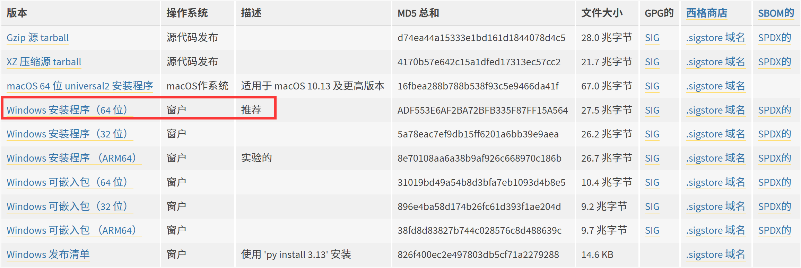
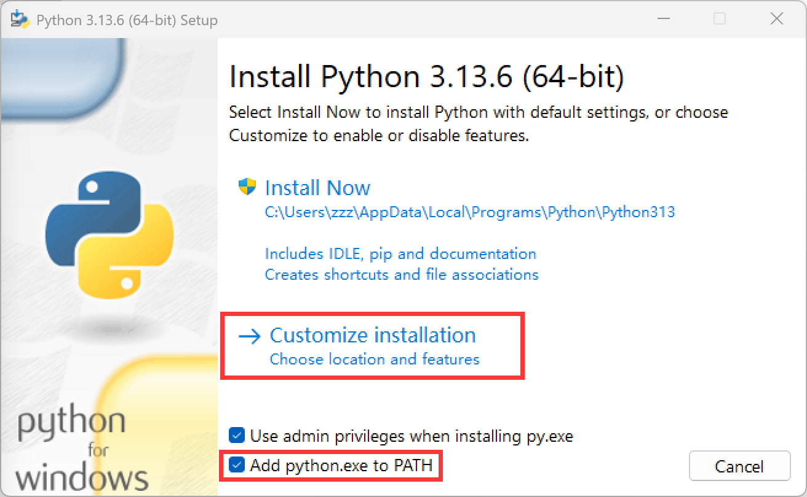
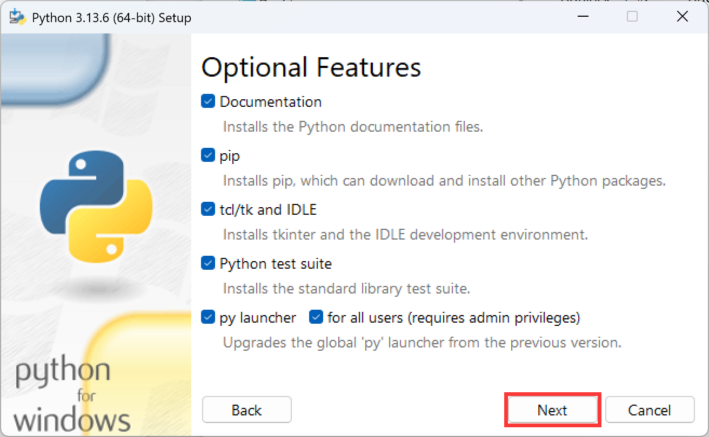
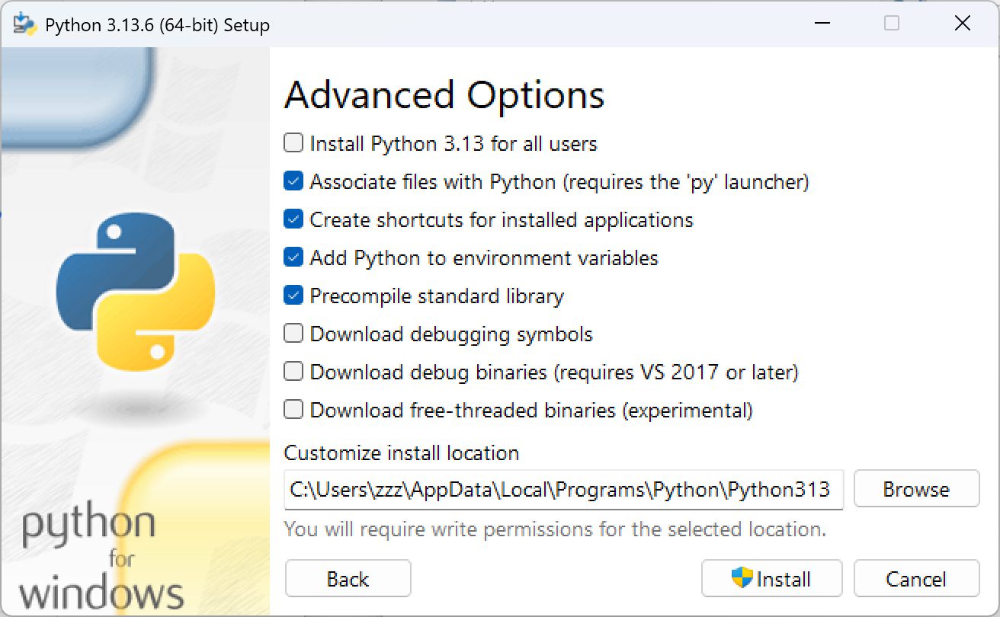
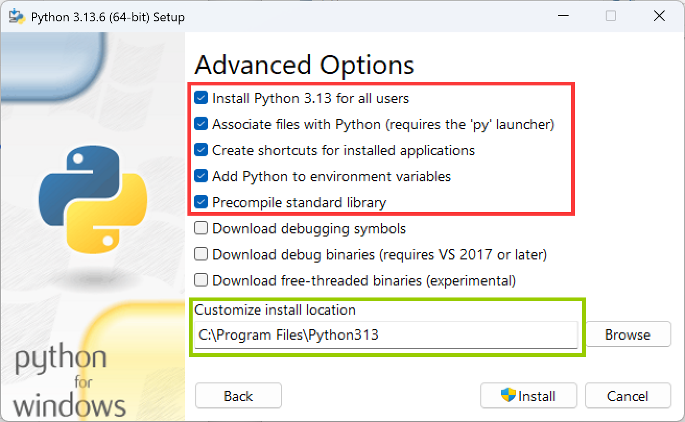
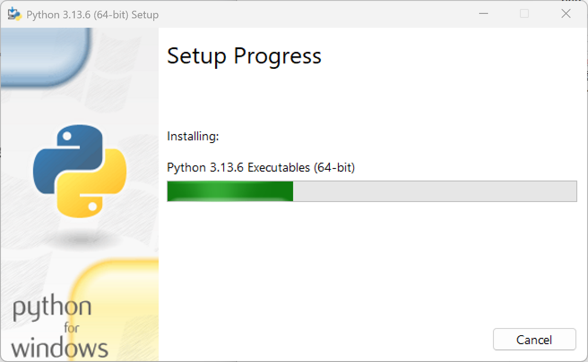
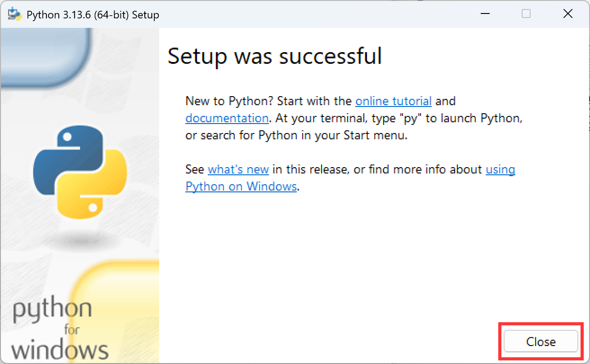
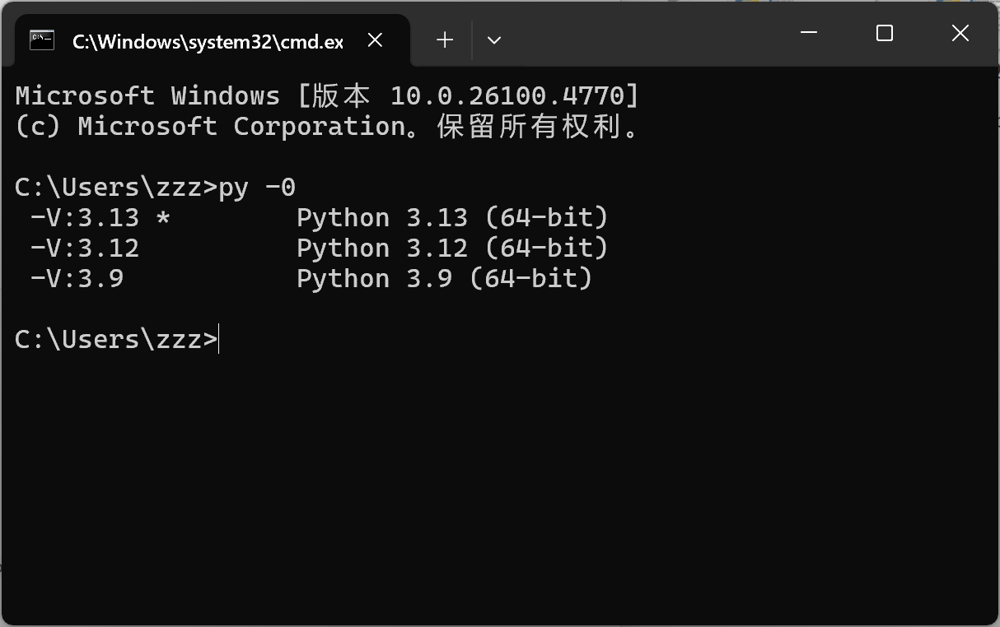

<table>
  <tr>
    <td style="text-align: center;">
      <a href="链接">
        
        <br>
        <span>名称</span>
      </a>
    </td>
    <td style="text-align: center;">
      <a href="链接">
        
        <br>
        <span>名称</span>
      </a>
    </td>
    <td style="text-align: center;">
      <a href="链接">
        
        <br>
        <span>名称</span>
      </a>
    </td>
    <td style="text-align: center;">
      <a href="链接">
        
        <br>
        <span>名称</span>
      </a>
    </td>
    </tr>
</table>


——————————————————————————————————————————————————————————————————————————————————————————————————————————————


tree /f /a

原名在前，属性在后


软件名称 - 软件核心功能  的格式输出

在markdown备注软件分享网站 破解网站 汉化网站
 
贴图，贴一张放一个，确保一一对应

VMware 解锁

补充微信多开脚本
一个文本/图片打开多个URL链接窗口，在markdown文件中
过于小众或者文件复杂的或盗版或可能被和谐的软件就不上传了，保留到硬盘中


推荐有图标，同类一般无图标
360zip Bandzip
7z  winrar


右键固定到快速访问
——————————————————————————————————————————————————————————————————————————————————————————————————————————————


交流论坛

<table>
  <tr>
    <td style="text-align: center;">
      <a href="https://msdn.itellyou.cn/">
        
        <br>
        <span>MSDN 我告诉你</span>
      </a>
    </td>
    <td style="text-align: center;">
      <a href="链接">
        
        <br>
        <span>名称</span>
      </a>
    </td>
    <td style="text-align: center;">
      <a href="链接">
        
        <br>
        <span>名称</span>
      </a>
    </td>
    <td style="text-align: center;">
      <a href="链接">
        
        <br>
        <span>名称</span>
      </a>
    </td>
    </tr>
</table>


https://www.landiannews.com/
https://www.52pojie.cn/
https://www.ghxi.com/
https://www.dayanzai.me/
https://www.52pojie.cn/
https://www.coolexe.com/
https://www.appinn.com/
https://www.yrxitong.com/

——————————————————————————————————————————————————————————————————————————————————————————————————————————————

账号密码


TIA
[VMware 工作站专业版](https://support.broadcom.com/group/ecx/productdownloads?subfamily=VMware%20Workstation%20Pro&freeDownloads=true)
```bash
1135604098@qq.com
Password@123
```


——————————————————————————————————————————————————————————————————————————————————————————————————————————————


# BIOS/UEFI与MBR/GPT：核心区别与强制搭配指南
结合知乎常见技术科普逻辑（侧重“历史演进+功能限制+实际应用”），及此前对话的场景化经验，以下从**核心区别**和**强制搭配**两方面梳理，兼顾技术原理与实操性。


## 一、先搞懂：BIOS vs UEFI（启动“桥梁”的区别）
BIOS和UEFI是电脑开机时“连接硬件与系统”的核心程序，本质是**不同时代的启动标准**，决定了电脑能识别哪种分区表、支持哪些功能。

| 对比维度       | BIOS（传统标准）                | UEFI（现代标准）                  |
|----------------|---------------------------------|-----------------------------------|
| 诞生背景       | 1970s为早期PC设计，适配小容量硬件 | 2000s后推出，解决BIOS的容量/速度瓶颈 |
| 启动流程       | POST自检→读取硬盘**第一个扇区（MBR）** →引导系统 | 硬件初始化→读取**ESP分区（GPT专属）** →引导系统 |
| 支持分区表     | 仅支持MBR（无法识别GPT）        | 仅支持GPT（部分主板可开“Legacy兼容模式”支持MBR） |
| 核心限制       | 1. 硬盘最大仅支持2TB；2. 最多4个主分区 | 1. 硬盘容量无上限（理论18EB）；2. 最多128个主分区 |
| 安全功能       | 无Secure Boot（易被恶意引导）   | 支持Secure Boot（Win11强制要求，防非法系统） |
| 操作体验       | 纯文本界面，仅支持键盘          | 图形化界面，支持鼠标，部分带触控       |
| 启动速度       | 慢（串行初始化硬件）            | 快（并行初始化硬件，支持“快速启动”）   |
| 兼容系统       | 适配WinXP/Win7等老系统          | 适配Win8及以上新系统（Win11必须UEFI）  |


## 二、再理清：MBR vs GPT（硬盘“分区地图”的区别）
MBR和GPT是硬盘存储“分区信息”的格式，相当于**硬盘的“地图”**，决定了电脑能识别多大硬盘、分多少区，且必须与启动方式（BIOS/UEFI）匹配。

| 对比维度       | MBR（主引导记录）               | GPT（全局唯一标识分区表）         |
|----------------|---------------------------------|-----------------------------------|
| 存储位置       | 硬盘第一个扇区（512字节，易损坏） | 分区表存多处+备份（损坏后可恢复）   |
| 硬盘容量限制   | 最大支持2TB（超2TB部分无法识别） | 无容量限制（支持2TB以上大容量硬盘） |
| 主分区数量     | 最多4个（需扩展分区才能分更多逻辑分区） | 最多128个主分区（无需扩展分区）     |
| 配套分区       | 无专属分区                      | 必须有**ESP分区（FAT32，存引导文件）** 和**MSR分区（预留空间，支持加密等功能）** |
| 数据安全性     | 分区表损坏后难恢复（无备份）    | 分区表有冗余备份，抗损坏能力强       |
| 支持启动方式   | 仅支持BIOS启动                  | 仅支持UEFI启动（核心匹配逻辑）       |
| 适用场景       | 老旧电脑、2TB以内硬盘、Win7及以下系统 | 新电脑、2TB以上硬盘、Win8及以上系统（Win11必选） |


## 三、关键规则：强制搭配，不能乱组合
电脑启动的核心逻辑是“**启动方式（BIOS/UEFI）必须与分区表（MBR/GPT）一一对应**”，混配会直接导致“找不到系统”或安装失败，具体搭配如下：

### 1. 唯一合法搭配（必记）
| 启动方式 | 强制对应分区表 | 适用场景（结合实操）                |
|----------|----------------|-------------------------------------|
| BIOS     | MBR            | 老电脑装Win7 32位、2TB以内硬盘存储  |
| UEFI     | GPT            | 新电脑装Win10/11、2TB以上硬盘、双系统（Win+Linux） |

### 2. 常见误区：为什么不能混配？
- 误区1：“UEFI主板装MBR硬盘”→ UEFI只能读GPT的ESP分区，找不到MBR的引导记录，会提示“无启动设备”；  
- 误区2：“BIOS主板装GPT硬盘”→ BIOS只能读MBR的第一个扇区，读不懂GPT的分区信息，同样无法启动；  
- 误区3：“开UEFI Legacy模式用MBR”→ 部分新主板支持“Legacy兼容模式”（可在BIOS中切换），能让UEFI识别MBR硬盘，但会丢失UEFI的速度和安全优势（如无法开Secure Boot、快速启动），仅临时救急（如老系统迁移），不推荐长期用。


## 四、实操场景：结合之前的搭配表，补充关键细节
| 场景                | 启动方式+分区表 | 核心注意事项（避坑点）                          |
|---------------------|-----------------|---------------------------------------------|
| 新电脑装Win11       | UEFI+GPT        | 必须开“Secure Boot”和“TPM 2.0”（Win11强制要求），ESP分区由系统自动创建（约260MB） |
| 老旧电脑装Win7 32位 | BIOS+MBR        | 硬盘必须≤2TB，若存4GB以上大文件，数据分区选NTFS（FAT32存不了大文件） |
| 双系统（Win10+Ubuntu） | UEFI+GPT    | 共享1个ESP分区（建议512MB，够存双系统引导文件），先装Win10再装Ubuntu（避免覆盖引导） |
| 2TB以上硬盘存数据   | UEFI+GPT        | 无需创建ESP/MSR分区（仅存数据，不参与启动），全部分为NTFS分区（兼容Windows） |


## 五、总结：3句话搞定选择
1. 新电脑（2012年后）、装Win10/11、用2TB以上硬盘→ 选**UEFI+GPT**；  
2. 老电脑（2011年前）、装Win7及以下、用2TB以内硬盘→ 选**BIOS+MBR**；  
3. 记住“UEFI配GPT，BIOS配MBR”，混配必出错，别尝试“兼容模式”长期用。


# UEFI+GPT/BIOS+MBR 分区情况、文件系统及删除规则
结合两种启动搭配的核心逻辑，从“默认分区”“文件系统适配”“分区删除规则”三方面拆解，清晰说明各分区的作用与操作边界。


## 一、两种搭配下的默认分区及文件系统
### 1. UEFI+GPT（新电脑/Win10/11/大硬盘）
UEFI启动依赖GPT分区表的**专属核心分区**，默认会生成3类关键分区（系统安装时自动创建，无需手动干预），文件系统有严格限制：

| 分区名称       | 作用（通俗理解）                  | 文件系统       | 大小建议       | 能否删除？ | 删除影响                     |
|----------------|-----------------------------------|----------------|----------------|------------|------------------------------|
| ESP分区        | 存“启动钥匙”（如Win的引导文件）   | 必须是FAT32    | 100-512MB（Win11默认260MB） | ❌ 不能删  | 电脑找不到启动文件，直接开不了机 |
| MSR分区        | 系统“预留空间”（支持BitLocker加密、磁盘扩展） | 无格式（隐藏） | 128MB（≥16GB硬盘） | ❌ 不能删  | 无法启用BitLocker，磁盘扩展可能失败 |
| 系统分区（C盘）| 装操作系统（Win10/11）            | 推荐NTFS       | 至少100GB      | ❌ 不建议删 | 系统丢失，所有软件/数据清空   |
| 数据分区（D/E盘）| 存文件（文档、视频等）            | 推荐NTFS       | 剩余空间分配   | ✅ 可以删  | 仅丢失该分区内的数据，不影响启动 |
| 品牌机恢复分区 | 存出厂系统镜像（如联想/戴尔的恢复文件） | NTFS（隐藏）   | 10-20GB        | ✅ 可删（慎）| 丢失“一键恢复出厂系统”功能，不影响当前系统 |


### 2. BIOS+MBR（老电脑/Win7/小硬盘≤2TB）
BIOS启动无专属核心分区，分区结构更简单，仅需区分“主分区”和“扩展分区”：

| 分区名称       | 作用（通俗理解）                  | 文件系统       | 大小建议       | 能否删除？ | 删除影响                     |
|----------------|-----------------------------------|----------------|----------------|------------|------------------------------|
| 主分区（C盘）  | 装操作系统（Win7）                | 推荐NTFS       | 至少50GB       | ❌ 不建议删 | 系统丢失，软件/数据清空       |
| 主分区（D盘）  | 存数据（可选，MBR最多4个主分区）  | FAT32/NTFS     | 按需分配       | ✅ 可以删  | 仅丢失该分区数据             |
| 扩展分区       | “容器”：装多个逻辑分区（突破4主分区限制） | 无格式（仅作容器） | 剩余空间       | ✅ 可以删  | 会连带删除扩展分区内所有逻辑分区 |
| 逻辑分区（E/F盘）| 存数据（扩展分区内创建）          | FAT32/NTFS     | 按需分配       | ✅ 可以删  | 仅丢失该逻辑分区数据         |
| 老品牌机恢复分区 | 存Win7出厂镜像（部分机型有）      | NTFS（隐藏）   | 5-15GB         | ✅ 可删（慎）| 丢失“一键恢复”功能           |


## 二、常见文件系统（FAT16/FAT32/NTFS）区别与适配
不同分区需搭配对应的文件系统，核心是“**功能匹配需求**”，避免格式错误导致无法使用：

| 文件系统 | 核心特点                          | 单文件大小限制 | 分区大小限制  | 适用场景（对应分区）                | 优缺点                     |
|----------|-----------------------------------|----------------|---------------|-------------------------------------|----------------------------|
| FAT16    | 兼容性极老（支持DOS/Win98）       | ≤2GB           | ≤4GB          | 老设备（如老式U盘、工业设备）       | ✅ 兼容老系统；❌ 容量/文件限制大，几乎淘汰 |
| FAT32    | 跨系统兼容（Win/Mac/Linux都能读） | ≤4GB           | ≤32GB（实际） | 1. UEFI的ESP分区（必须用）；2. 小U盘（≤32GB） | ✅ 兼容性强；❌ 存不了大文件（如4GB以上视频） |
| NTFS     | 功能全（支持加密、权限、大文件）  | 接近16EB（无限制） | ≤256TB        | 1. 系统分区（C盘）；2. 数据分区（D/E盘）；3. 恢复分区 | ✅ 支持大文件/加密；❌ Mac/Linux默认只读（需装工具） |
| EXT4     | Linux专属（如Ubuntu）             | 接近16EB       | ≤1EB          | 双系统中Ubuntu的系统/数据分区       | ✅ 适配Linux；❌ Windows默认读不了（需工具） |


## 三、分区删除的核心规则：能删什么？删了有什么用？
### 1. 能删的分区（安全边界）
只有“**非启动、非系统、非预留**”的分区可删，核心是：  
- 数据分区（D/E/F盘，无论UEFI还是BIOS）；  
- 品牌机恢复分区（不依赖出厂恢复功能时）；  
- BIOS下的扩展分区/逻辑分区（不影响主分区系统时）。

### 2. 不能删的分区（删除即故障）
删了会导致“**启动失败**”或“**核心功能失效**”，绝对不能动：  
- UEFI+GPT的ESP分区、MSR分区；  
- 任何搭配下的“系统分区（C盘）”；  
- BIOS下扩展分区内的“逻辑分区”若关联系统文件（罕见），也不能删。

### 3. 删除分区的作用（为什么要删？）
- **腾空间**：合并小分区（如删D盘，把空间分给C盘）；  
- **重新规划**：重装系统前删所有分区，避免旧分区干扰；  
- **清理无用分区**：删品牌机自带的冗余恢复分区（节省空间）；  
- **修复问题**：删除损坏的逻辑分区（如无法格式化的分区）。

### 4. 删除前必做：规避风险
1. **备份数据**：无论删哪个分区，先把里面的重要文件（照片、文档）拷贝到其他硬盘；  
2. **确认分区类型**：用“磁盘管理”（Win+X打开）确认分区是否为“系统分区/ESP分区”，避免误删；  
3. **慎删隐藏分区**：隐藏分区（如MSR、恢复分区）默认不显示，删前先查用途（品牌机官网可查）。


## 四、总结：关键记3点
1. **UEFI+GPT必保2个分区**：ESP（FAT32）和MSR，删了开不了机；  
2. **BIOS+MBR注意4主分区限制**：超4个分区需建扩展分区，删扩展分区会丢逻辑分区；  
3. **文件系统匹配需求**：ESP必须FAT32，系统/数据分区用NTFS，小U盘用FAT32。


在启动设置中，**HDD和FDD并非“启动模式”（启动模式是UEFI/BIOS），而是“启动设备类型”**——即电脑开机时优先从哪个硬件读取系统文件。两者是早期到现在常见的存储设备，核心区别在于硬件形态和功能，具体如下：


## 一、先明确：启动模式 vs 启动设备
很多人会混淆这两个概念，先简单区分：
- **启动模式**：UEFI/BIOS，是电脑“识别硬件、引导系统”的底层规则（比如UEFI只能读GPT硬盘，BIOS读MBR硬盘）；  
- **启动设备**：HDD/FDD/USB/CD-ROM等，是“存储系统文件的硬件”（比如系统装在硬盘里，就选HDD启动）；  
简单说：启动模式是“规则”，启动设备是“执行规则的硬件”。


## 二、HDD：硬盘启动（现在最常用）
### 1. 全称与含义
HDD = **Hard Disk Drive**，即“硬盘驱动器”，包括我们现在常用的：
- 机械硬盘（传统HDD，靠磁盘旋转读写）；  
- 固态硬盘（SSD，虽叫SSD，但在启动设备列表里仍常标注为“HDD”，本质都是“硬盘类存储”）。

### 2. 核心作用
电脑开机时，若启动设备选“HDD”，则会从硬盘中读取系统引导文件（比如UEFI+GPT的ESP分区、BIOS+MBR的MBR扇区），进而加载Windows/Linux等系统——**这是现在绝大多数电脑的“默认启动设备”**（因为系统都装在硬盘里）。

### 3. 实操场景
- 正常使用电脑：启动设备设为“HDD”（确保从硬盘启动已安装的系统）；  
- 重装系统后：需确认启动设备仍为“HDD”（避免误选USB/CD-ROM导致反复进入安装界面）；  
- 多硬盘场景：若电脑接了2块硬盘（如SSD+机械硬盘），启动设备列表会显示“硬盘1（SSD）”“硬盘2（机械硬盘）”，选装了系统的那一块（通常是SSD，启动更快）。


## 三、FDD：软盘启动（已淘汰，仅老设备可见）
### 1. 全称与含义
FDD = **Floppy Disk Drive**，即“软盘驱动器”，对应早期的“软盘”（3.5英寸或5.25英寸的软磁盘，容量仅1.44MB，像小型光盘）。

### 2. 核心作用
在2000年以前，软盘是主流移动存储设备，电脑会通过FDD读取软盘里的系统文件（比如早期DOS系统、系统修复工具）——**现在软盘和FDD早已淘汰，新主板（2010年后）基本不再支持FDD接口，启动设备列表里也很少出现FDD选项**。

### 3. 实操场景
- 仅老电脑（如2005年前的台式机）可能在BIOS启动列表里看到FDD；  
- 现在遇到FDD选项：无需理会，直接设为“禁用”或“优先级最低”（避免因找不到软盘导致启动报错）。


## 四、常见启动设备对比：除了HDD/FDD，还有这些
在BIOS/UEFI启动设置里，除了HDD和FDD，还会看到其他设备，按需选择即可：

| 启动设备类型 | 全称/含义                | 核心用途（什么时候选）                  |
|--------------|--------------------------|-----------------------------------------|
| HDD          | 硬盘驱动器               | 日常启动已安装的系统（默认选这个）      |
| FDD          | 软盘驱动器               | 老设备读取软盘（现在基本不用）          |
| USB          | USB存储设备（U盘/移动硬盘） | 重装系统（从U盘启动安装包）            |
| CD-ROM/DVD   | 光盘驱动器               | 从系统光盘启动（现在被U盘替代，较少用） |
| Network      | 网络启动                 | 企业批量装机（通过局域网加载系统）      |


## 五、总结：关键记2点
1. **HDD是现在的核心启动设备**：系统装在硬盘（SSD/机械硬盘）里，开机就选HDD，别选错；  
2. **FDD是历史产物**：新电脑看不到，老电脑遇到也不用管，优先选HDD或USB；  
3. 若重装系统：先把启动设备优先级设为“USB”（从U盘启动安装包），装完后改回“HDD”（从硬盘启动系统）。


# 系统镜像格式（重装/恢复专用）详解表
| 格式名   | 全称/核心定义                | 技术特性/关联工具                                                                 | 用途与常见场景                                                                 | 优缺点/注意事项                                                                 |
|----------|------------------------------|-----------------------------------------------------------------------------------|------------------------------------------------------------------------------|--------------------------------------------------------------------------------|
| ISO      | 光盘镜像格式（遵循ISO 9660标准） | - 包含完整文件系统结构（模拟光盘分区）；<br>- 支持工具：Rufus、UltraISO、BalenaEtcher、微软MediaCreationTool | 1. **全平台系统安装**：Windows（Win10/11官方镜像均为ISO）、Linux（Ubuntu/CentOS镜像）、macOS（安装镜像需转换为ISO或DMG）；<br>2. **启动介质制作**：写入U盘（UEFI/BIOS均支持）或刻录光盘，直接引导装机；<br>3. **系统备份归档**：将已安装的系统分区打包为ISO，便于跨设备迁移 | ✅ 优势：兼容性极强（所有装机工具支持）、支持UEFI安全启动、可直接挂载查看文件；<br>❌ 缺点：压缩率较低（比GHO/WIM大10%-20%）、不支持增量备份 |
| GHO      | Ghost镜像格式（Norton Ghost专属） | - 按扇区备份分区/硬盘数据；<br>- 支持工具：Symantec Ghost 15、装机员PE（一键Ghost）、DiskGenius | 1. **个人/批量装机**：第三方精简系统（如“纯净版Win10”“游戏专用系统”）多为GHO格式，恢复速度快（10分钟内完成系统部署）；<br>2. **本地系统备份**：将C盘（系统分区）完整备份为GHO，故障时一键还原；<br>3. **老旧设备适配**：对BIOS+MBR机型兼容性极佳，早期PE工具默认支持 | ✅ 优势：压缩率高（比ISO小20%-30%）、恢复速度快、操作简单（小白易上手）；<br>❌ 缺点：<br>- 早期版本不支持GPT分区（新版Ghost 15已兼容）；<br>- 不支持“多系统共存”（一个GHO仅对应单系统）；<br>- 镜像文件易损坏（需校验MD5） |
| WIM      | Windows Imaging Format（微软官方镜像格式） | - 基于文件级备份（非扇区），支持“单文件多版本”；<br>- 关联工具：DISM（微软官方命令）、ImageX、NTLite | 1. **微软原生系统部署**：Win10/11安装包中核心文件“install.wim”（含Home/Pro/Enterprise等多版本，装机时选择对应版本）；<br>2. **系统增量备份**：对已备份的WIM镜像，仅追加更新的文件（适合日常系统备份，节省空间）；<br>3. **企业级部署**：通过微软SCCM（系统中心配置管理器）批量推送WIM镜像，统一装机 | ✅ 优势：支持增量/差异备份、可修改镜像内容（如注入驱动/补丁）、兼容GPT+UEFI、文件级备份（镜像损坏仅丢失单个文件）；<br>❌ 缺点：仅支持Windows系统、恢复速度比GHO慢（文件级校验耗时） |
| ESD      | Electronic Software Download（微软高压缩镜像） | - 基于WIM改进，采用LZMS高压缩算法；<br>- 关联工具：DISM（支持ESD与WIM互转）、7-Zip（解压查看） | 1. **微软系统分发**：微软官网早期Win10/11更新包、“精简版系统”常用ESD（如“Win11 22H2 精简版.esd”）；<br>2. **小容量存储场景**：U盘空间不足时，用ESD减少镜像体积（比WIM小30%+，Win11镜像可从5GB压至3.5GB） | ✅ 优势：压缩率极高（系统镜像体积最小）、支持微软官方签名（安全性高）；<br>❌ 缺点：<br>- 解压/恢复速度慢（比WIM多耗时5-10分钟）；<br>- 部分第三方工具不支持直接恢复（需先转WIM）；<br>- 微软官方ESD可能加密（需解密后使用） |
| VHD/VHDX | 虚拟硬盘镜像格式（微软虚拟存储标准） | - VHD：最大支持2TB，兼容Win7及以上；<br>- VHDX：升级款（支持64TB、4K对齐、日志式存储）；<br>- 关联工具：Windows磁盘管理、Hyper-V、Disk2vhd | 1. **原生启动系统**：Win10/11支持从VHDX启动（将VHDX作为“虚拟系统盘”，无需虚拟机，直接在物理机引导）；<br>2. **系统测试/隔离**：在现有系统中挂载VHDX，安装测试版系统（如Win12预览版），不影响原系统；<br>3. **系统备份迁移**：将旧电脑系统打包为VHDX，直接挂载到新电脑使用（需确保硬件兼容） | ✅ 优势：可直接挂载查看/修改文件（无需完整恢复）、VHDX支持4K硬盘（性能更好）、适合多系统隔离；<br>❌ 缺点：启动速度比物理硬盘慢5%-10%、部分老主板（2015年前）不支持VHDX启动 |
| IMG      | 通用镜像格式（按扇区复制的原始镜像） | - 无固定标准，多为“扇区级完整备份”；<br>- 关联工具：Win32 Disk Imager、BalenaEtcher、dd（Linux命令） | 1. **Linux/嵌入式系统**：树莓派（Raspbian镜像为IMG）、ARM架构设备（如开发板系统）、Linux服务器（CentOS嵌入式版）；<br>2. **老旧系统备份**：Win98/XP等老系统，用IMG备份完整硬盘（含MBR分区表）；<br>3. **特殊设备装机**：工业电脑、路由器（OpenWRT固件多为IMG） | ✅ 优势：对小众架构兼容性好（ARM/MIPS）、支持“裸机恢复”（直接写入硬盘即可启动）；<br>❌ 缺点：<br>- 体积大（按硬盘容量计算，空空间也会备份）；<br>- 不支持Windows系统增量备份；<br>- 需匹配硬件架构（如ARM的IMG不能用于x86电脑） |

——————————————————————————————————————————————————————————————————————————————————————————————————————————————

系统安装

Windows 重装系统国家选择美国/欧盟


## bios 配置

CPU 虚拟化
安全模式
开盖启动
引导模式


## 系统分盘


系统盘（C:300）C 系统
软件盘（D:300）D 软件安装路径 TIA fanuc 2345破解版 迅雷破解版（避免C盘安装请求权限问题） 在 D 盘创建 "Program Files" 和 "Program Files (x86)" 目录，模拟默认安装路径
资源库（E:200）E 安装包/镜像/文件夹背景图(固定文件)/VMware打包镜像/IDM配置文件，激活文件/VM限制解锁/VMtools/PE软件
数据盘（F:130）F 文件/共享文件夹/VMware虚拟机

## 重装系统
Windows  专业工作站版
不要使用中文名
关闭隐私
修改oobe

## 文件


Windows 镜像
PE 镜像


[创建 Windows 10 安装媒体](https://www.microsoft.com/zh-cn/software-download/windows10)

[创建 Windows 11 安装媒体](https://www.microsoft.com/zh-cn/software-download/windows11?msockid=29d1afb24e32636214bbba6e4f1f6205)


——————————————————————————————————————————————————————————————————————————————————————————————————————————————
系统设置

C:\Users 固定
开机自启文件夹
clash verge文件夹
苹果备份路径
浏览器垂直标签


系统激活
驱动
更新系统 商店
关闭磁盘锁BitLocker
传递优化
自动更新
防篡改 时实扫描
(关闭)安全中心 防火墙

UAC窗口
关闭系统广告
关闭浏览器广告
电源键 开合盖 睡眠模式 快速启动

控制面板-Windows程序-安装
.net 3.5
安卓子系统

当按住CTRL键时显示鼠标指针位置


——————————————————————————————————————————————————————————————————————————————————————————————————————————————
软件 安装表


ROBOGUIDE>TIA >SOLIDWORK


——————————————————————————————————————————————————————————————————————————————————————————————————————————————


破解软件


微信双开脚本
小米生态两个版本


——————————————————————————————————————————————————————————————————————————————————————————————————————————————
python 安装
















```cmd
py -0
```





——————————————————————————————————————————————————————————————————————————————————————————————————————————————
配置设置


IDM文件类型
```bash
3GP 7Z AAC ACE AIF APK ARJ ASF AVI BIN BZ2 EXE GZ GZIP IMG ISO LZH M4A M4V MKV MOV MP3 MP4 MPA MPE MPEG MPG MSI MSU OGG OGV PDF PLJ PPS PPT QT R0* R1* RA RAR RM RMVB SEA SIT SITX TAR TIF TIFF WAV WMA WMV Z ZIP 3GP 7Z AAC ACE AI AIF ALZ APK APP ARC ARJ ASF AVI BH BIN BR BUNDLE BZ BZ2 CDA CSV DIF DLL DMG DOC DOCX EGG EPS EXE FLV GZ GZIP IMG IPA ISO ISZ JAR KEXT LHA LZ LZH LZMA M4A M4V MDB MID MKV MOV MP3 MP4 MPA MPE MPEG MPG MSI MSU MUI OGG OGV PDF PKG PPT PPTX PSD PST PUB QT R0* R1* RA RAR RM RMVB RTF SEA SIT SITX SLDM SLDX TAR TBZ TBZ2 TGZ TIF TIFF TLZ TXZ UDF VOB VSD VSDM VSDX VSS VSSM VST VSTM VSTX WAR WAV WBK WIM WKS WMA WMD WMS WMV WMZ WP5 WPD WPS XLS XLSX XPS XZ Z ZIP ZIPX ZPAQ ZSTD
```


——————————————————————————————————————————————————————————————————————————————————————————————————————————————


### **拓展脚本下载**  

<table>
  <tr>
    <td style="text-align: center;">
      <a href="https://microsoftedge.microsoft.com/addons/Microsoft-Edge-Extensions-Home?hl=zh-CN">
        
        <br>
        <span>Edge 扩展</span>
      </a>
    </td>
  <td style="text-align: center;">
      <a href="https://chromewebstore.google.com/?hl=zh-CN&utm_source=ext_sidebar">
        
        <br>
        <span>Chrome 应用商店</span>
      </a>
    </td>
  <td style="text-align: center;">
      <a href="https://www.crxsoso.com/">
        
        <br>
        <span>Crx搜搜</span>
      </a>
    </td>
  </tr>
</table>


### **一、广告拦截与去广告工具**  


<table>
  <tr>
  <td style="text-align: center;">
      <a href="https://microsoftedge.microsoft.com/addons/detail/adblock-plus-%E5%85%8D%E8%B4%B9%E7%9A%84%E5%B9%BF%E5%91%8A%E6%8B%A6%E6%88%AA%E5%99%A8/gmgoamodcdcjnbaobigkjelfplakmdhh">
        
        <br>
        <span>Adblock Plus</span>
      </a>
    </td>
    <td style="text-align: center;">
      <a href="https://microsoftedge.microsoft.com/addons/detail/adguard-%E5%B9%BF%E5%91%8A%E6%8B%A6%E6%88%AA%E5%99%A8/pdffkfellgipmhklpdmokmckkkfcopbh">
        
        <br>
        <span>AdGuard</span>
      </a>
  </tr>
</table>

### **四、翻译工具**  


<table>
  <tr>
  <td style="text-align: center;">
      <a href="https://microsoftedge.microsoft.com/addons/detail/%E6%B2%89%E6%B5%B8%E5%BC%8F%E7%BF%BB%E8%AF%91-%E7%BD%91%E9%A1%B5%E7%BF%BB%E8%AF%91%E6%8F%92%E4%BB%B6-pdf%E7%BF%BB%E8%AF%91-/amkbmndfnliijdhojkpoglbnaaahippg">
        
        <br>
        <span>沉浸式翻译</span>
      </a>
    </td>
    <td style="text-align: center;">
      <a href="https://microsoftedge.microsoft.com/addons/detail/%E5%88%92%E8%AF%8D%E7%BF%BB%E8%AF%91/oikmahiipjniocckomdccmplodldodja">
        
        <br>
        <span>划词翻译</span>
      </a>
    </td>
  </tr>
</table>


- **显示优化**：  


<table>
  <tr>
  <td style="text-align: center;">
      <a href="https://chromewebstore.google.com/detail/dark-reader/eimadpbcbfnmbkopoojfekhnkhdbieeh">
        
        <br>
        <span>暗色模式</span>
      </a>
    </td>
        <td style="text-align: center;">
      <a href="https://www.youxiaohou.com/tool/install-darkmode.html">
        
        <br>
        <span>夜间模式助手</span>
      </a>
    </td>
    <td style="text-align: center;">
      <a href="https://greasyfork.org/zh-CN/scripts/426377-dark-mode">
        
        <br>
        <span>护眼模式</span>
      </a>
    </td>
  </tr>
</table>


### **截图工具**  


<table>
  <tr>
  <td style="text-align: center;">
      <a href="https://microsoftedge.microsoft.com/addons/detail/%E6%8D%95%E6%8D%89%E7%BD%91%E9%A1%B5%E6%88%AA%E5%9B%BE-fireshot%E7%9A%84/fcbmiimfkmkkkffjlopcpdlgclncnknm">
        
        <br>
        <span>捕捉网页截图</span>
      </a>
    </td>
      <td style="text-align: center;">
      <a href="https://microsoftedge.microsoft.com/addons/detail/%E8%8D%89%E6%96%99%E4%BA%8C%E7%BB%B4%E7%A0%81%E5%BF%AB%E9%80%9F%E7%94%9F%E7%A0%81%E5%92%8C%E8%A7%A3%E7%A0%81%E5%B7%A5%E5%85%B7/dkbiiofameebehokbgjmdcholafphbnl?hl=zh-CN">
        
        <br>
        <span>草料二维码</span>
      </a>
    </td>
  <td style="text-align: center;">
      <a href="https://microsoftedge.microsoft.com/addons/detail/scroll-to-top-button/dobeplcigkjlbajngcgnndecohjkjmia">
        
        <br>
        <span>回到顶部</span>
      </a>
    </td>
    <td style="text-align: center;">
      <a href="https://chromewebstore.google.com/detail/global-speed/jpbjcnkcffbooppibceonlgknpkniiff">
        
        <br>
        <span>视频速度调节</span>
      </a>
    </td>
    <td style="text-align: center;">
      <a href="https://microsoftedge.microsoft.com/addons/detail/%E6%89%A9%E5%B1%95%E7%AE%A1%E7%90%86%E5%99%A8/nfcpcmdnnjjchholfbcoaejiilnpgcmk">
        
        <br>
        <span>扩展管理器</span>
      </a>
    </td>
    <td style="text-align: center;">
      <a href="https://greasyfork.org/zh-CN/scripts/372673-%E8%AE%A1%E6%97%B6%E5%99%A8%E6%8E%8C%E6%8E%A7%E8%80%85-%E8%A7%86%E9%A2%91%E5%B9%BF%E5%91%8A%E8%B7%B3%E8%BF%87-%E8%A7%86%E9%A2%91%E5%B9%BF%E5%91%8A%E5%8A%A0%E9%80%9F%E5%99%A8">
        
        <br>
        <span>计时器掌控者</span>
      </a>
    </td>
    <td style="text-align: center;">
      <a href="https://greasyfork.org/zh-CN/scripts/24204-picviewer-ce">
        
        <br>
        <span>在线看图工具</span>
      </a>
    </td>
  </tr>
</table>


### **拓展脚本管理**  


<table>
  <tr>
  <td style="text-align: center;">
      <a href="https://microsoftedge.microsoft.com/addons/detail/%E7%AF%A1%E6%94%B9%E7%8C%B4/iikmkjmpaadaobahmlepeloendndfphd">
        
        <br>
        <span>篡改猴</span>
      </a>
    </td>
        <td style="text-align: center;">
      <a href="https://greasyfork.org/zh-CN">
        
        <br>
        <span>Greasy Fork论坛</span>
      </a>
    </td>
    <td style="text-align: center;">
      <a href="https://microsoftedge.microsoft.com/addons/detail/%E8%84%9A%E6%9C%AC%E7%8C%AB/liilgpjgabokdklappibcjfablkpcekh">
        
        <br>
        <span>脚本猫</span>
      </a>
    </td>
        <td style="text-align: center;">
      <a href="https://scriptcat.org/zh-CN/search">
        
        <br>
        <span>脚本猫论坛</span>
      </a>
    </td>
  </tr>
</table>


### **Greasy Fork**  

<table>
  <tr>
  <td style="text-align: center;">
      <a href="https://greasyfork.org/zh-CN/scripts/412956-greasyfork%E4%BC%98%E5%8C%96%E5%B7%A5%E5%85%B7-%E5%8C%85%E5%90%AB%E6%97%B6%E5%8C%BA%E8%BD%AC%E6%8D%A2-%E6%97%B6%E9%97%B4%E6%A0%BC%E5%BC%8F%E5%8C%96-%E4%B8%80%E9%94%AE%E5%A4%8D%E5%88%B6%E4%BB%A3%E7%A0%81-%E4%B8%80%E9%94%AE%E6%9F%A5%E7%9C%8B%E4%BB%A3%E7%A0%81-%E8%AE%BA%E5%9D%9B%E9%BB%98%E8%AE%A4%E6%98%BE%E7%A4%BA%E9%97%AE%E7%AD%94%E7%89%88%E5%9D%97%E8%80%8C%E4%B8%8D%E6%98%AF%E8%84%9A%E6%9C%AC%E5%8F%8D%E9%A6%88%E7%AD%89">
        
        <br>
        <span>GreasyFork优化工具</span>
      </a>
    </td>
  <td style="text-align: center;">
      <a href="https://greasyfork.org/zh-CN/scripts/393396-greasyfork-helper">
        
        <br>
        <span>GreasyFork网站助手</span>
      </a>
    </td>
        <td style="text-align: center;">
      <a href="https://greasyfork.org/zh-CN/scripts/412611-newscript-%E6%96%B0%E8%84%9A%E6%9C%AC%E9%80%9A%E7%9F%A5-%E4%B8%8D%E9%94%99%E8%BF%87%E4%BB%BB%E4%BD%95%E4%B8%80%E4%B8%AA%E5%A5%BD%E8%84%9A%E6%9C%AC">
        
        <br>
        <span>新脚本通知</span>
      </a>
    </td>
      <td style="text-align: center;">
      <a href="https://greasyfork.org/zh-CN/scripts/23840-greasyfork-search-with-sleazyfork-results-include">
        
        <br>
        <span>大人的Greasyfork</span>
      </a>
    </td>
  </tr>
</table>


### **自动翻页**  

<table>
  <tr>
  <td style="text-align: center;">
      <a href="https://greasyfork.org/zh-CN/scripts/438684-pagetual">
        
        <br>
        <span>东方永页机</span>
      </a>
    </td>
      <td style="text-align: center;">
      <a href="https://greasyfork.org/zh-CN/scripts/438656-%E8%87%AA%E5%8A%A8%E5%B1%95%E5%BC%80">
        
        <br>
        <span>自动展开</span>
      </a>
    </td>
  <td style="text-align: center;">
      <a href="https://greasyfork.org/zh-CN/scripts/419215-autopager">
        
        <br>
        <span>自动无缝翻页</span>
      </a>
    </td>
  <td style="text-align: center;">
      <a href="https://greasyfork.org/zh-CN/scripts/389621-%E9%A1%B5%E9%9D%A2%E8%87%AA%E5%8A%A8%E6%8B%BC%E6%8E%A5">
        
        <br>
        <span>页面自动拼接</span>
      </a>
    </td>
  </tr>
</table>


#### **1、解除网页限制**：  

<table>
  <tr>
    <td style="text-align: center;">
      <a href="https://github.com/rxliuli/userjs/blob/master/apps/unblock-web-restrictions/README.zhCN.md">
        
        <br>
        <span>解除网页限制</span>
      </a>
    </td>
    <td style="text-align: center;">
      <a href="https://www.youxiaohou.com/tool/bookmark.html#%F0%9F%94%8D-crx%E6%90%9C%E6%90%9C-%E4%BB%BB%E6%84%8F%E9%A1%B5%E9%9D%A2%E6%90%9C%E7%B4%A2%E6%89%A9%E5%B1%95">
        
        <br>
        <span>超级书签</span>
      </a>
    </td>
    <td style="text-align: center;">
      <a href="https://cat7373.github.io/remove-web-limits/">
        
        <br>
        <span>网页限制解除</span>
      </a>
    </td>
    <td style="text-align: center;">
      <a href="https://greasyfork.org/zh-CN/scripts/405130-%E6%96%87%E6%9C%AC%E9%80%89%E4%B8%AD%E5%A4%8D%E5%88%B6">
        
        <br>
        <span>文本选中复制</span>
      </a>
    </td>
  </tr>
</table>


<table>
  <tr>
        <td style="text-align: center;">
      <a href="https://greasyfork.org/zh-CN/scripts/443670-%E9%93%BE%E6%8E%A5%E7%AE%A1%E7%90%86">
        
        <br>
        <span>链接管理</span>
      </a>
    </td>
    <td style="text-align: center;">
      <a href="https://greasyfork.org/zh-CN/scripts/27752-searchenginejump-%E6%90%9C%E7%B4%A2%E5%BC%95%E6%93%8E%E5%BF%AB%E6%8D%B7%E8%B7%B3%E8%BD%AC">
        
        <br>
        <span>搜索引擎快捷跳转</span>
      </a>
    </td>
    <td style="text-align: center;">
      <a href="https://greasyfork.org/zh-CN/scripts/416338-redirect-%E5%A4%96%E9%93%BE%E8%B7%B3%E8%BD%AC">
        
        <br>
        <span>redirect 外链跳转</span>
      </a>
    </td>
  </tr>
</table>


<table>
  <tr>
    <td style="text-align: center;">
      <a href="https://www.youxiaohou.com/tool/install-starpassword.html">
        
        <br>
        <span>星号密码显示助手</span>
      </a>
    </td>
    <td style="text-align: center;">
      <a href="https://greasyfork.org/zh-CN/scripts/418942-%E4%B8%87%E8%83%BD%E9%AA%8C%E8%AF%81%E7%A0%81%E8%87%AA%E5%8A%A8%E8%BE%93%E5%85%A5-%E5%8D%87%E7%BA%A7%E7%89%88">
        
        <br>
        <span>万能验证码自动输入</span>
      </a>
    </td>
  </tr>
</table>


- **网盘识别**：  


<table>
  <tr>
  <td style="text-align: center;">
      <a href="https://www.youxiaohou.com/tool/install-panai.html">
        
        <br>
        <span>网盘智能识别助手</span>
      </a>
    </td>
    <td style="text-align: center;">
      <a href="https://scriptcat.org/zh-CN/script-show-page/373">
        
        <br>
        <span>网盘自动填写访问码</span>
      </a>
    </td>
  
  <td style="text-align: center;">
      <a href="https://greasyfork.org/zh-CN/scripts/416915-%E7%BD%91%E7%9B%98%E7%B2%BE%E7%81%B5">
        
        <br>
        <span>网盘精灵</span>
      </a>
    </td>
    <td style="text-align: center;">
      <a href="https://greasyfork.org/zh-CN/scripts/419224-%E8%93%9D%E5%A5%8F%E4%BA%91%E7%BD%91%E7%9B%98%E5%A2%9E%E5%BC%BA">
        
        <br>
        <span>蓝奏云网盘增强</span>
      </a>
    </td>
  </tr>
</table>


- **网盘下载**：  


<table>
  <tr>
      <td style="text-align: center;">
      <a href="https://www.youxiaohou.com/install.html#%F0%9F%93%96-%E4%BD%BF%E7%94%A8%E6%95%99%E7%A8%8B">
        
        <br>
        <span>网盘直链下载助手</span>
      </a>
    </td>
  <td style="text-align: center;">
      <a href="https://greasyfork.org/zh-CN/scripts/449291-linkswift">
        
        <br>
        <span>网盘直链下载助手</span>
      </a>
    </td>
<td style="text-align: center;">
      <a href="https://greasyfork.org/zh-CN/scripts/22590-easy-offline">
        
        <br>
        <span>全载</span>
      </a>
    </td>
<td style="text-align: center;">
      <a href="https://greasyfork.org/zh-CN/scripts/465078-tt%E5%8A%A9%E6%89%8B-%E7%99%BE%E5%BA%A6%E7%BD%91%E7%9B%98%E5%B7%A5%E5%85%B7%E7%AE%B1%E7%9B%B4%E9%93%BE%E8%A7%A3%E6%9E%90-%E6%8C%81%E7%BB%AD%E6%9B%B4%E6%96%B0">
        
        <br>
        <span>TT助手</span>
      </a>
    </td>
    <td style="text-align: center;">
      <a href="https://greasyfork.org/zh-CN/scripts/431256-%E8%BF%85%E9%9B%B7%E4%BA%91%E7%9B%98">
        
        <br>
        <span>迅雷云盘</span>
      </a>
    </td>
    <td style="text-align: center;">
      <a href="https://greasyfork.org/zh-CN/scripts/432415-onedrive-%E6%96%87%E4%BB%B6%E4%B8%8B%E8%BD%BD%E7%9B%B4%E9%93%BE">
        
        <br>
        <span>OneDrive 文件下载直链</span>
      </a>
    </td>
  </tr>
</table>


- **下载辅助**：  


<table>
  <tr>
      <td style="text-align: center;">
      <a href="https://microsoftedge.microsoft.com/addons/detail/%E7%8C%AB%E6%8A%93/oohmdefbjalncfplafanlagojlakmjci">
        
        <br>
        <span>猫抓</span>
      </a>
    </td>
    <td style="text-align: center;">
      <a href="https://chromewebstore.google.com/detail/aria2-explorer/mpkodccbngfoacfalldjimigbofkhgjn?pli=1">
        
        <br>
        <span>Aria2 Explorer</span>
      </a>
    </td>
      <td style="text-align: center;">
      <a href="https://greasyfork.org/zh-CN/scripts/380918-%E4%B8%8B%E8%BD%BD%E5%8D%AB%E5%A3%AB">
        
        <br>
        <span>下载卫士</span>
      </a>
    </td>
  </tr>
</table>


### **Github脚本**  

<table>
  <tr>
    <td style="text-align: center;">
      <a href="https://microsoftedge.microsoft.com/addons/detail/github%E5%8A%A0%E9%80%9F/alhnbdjjbokpmilgemopoomnldpejihb">
        
        <br>
        <span>GitHub加速</span>
      </a>
    </td>
    <td style="text-align: center;">
      <a href="https://microsoftedge.microsoft.com/addons/detail/githubcn/onlodfoebaobhmlhgcbddjngjbkdbfaj">
        
        <br>
        <span>GithubCN</span>
      </a>
    </td>
        <td style="text-align: center;">
      <a href="https://greasyfork.org/zh-CN/scripts/412245-github-enhancement-high-speed-download">
        
        <br>
        <span>Github 增强</span>
      </a>
    </td> 
  <td style="text-align: center;">
      <a href="https://greasyfork.org/zh-CN/scripts/398278-github-%E9%95%9C%E5%83%8F%E8%AE%BF%E9%97%AE-%E5%8A%A0%E9%80%9F%E4%B8%8B%E8%BD%BD">
        
        <br>
        <span>Github 镜像访问</span>
      </a>
    </td>
  <td style="text-align: center;">
      <a href="https://greasyfork.org/zh-CN/scripts/435208-github-%E4%B8%AD%E6%96%87%E5%8C%96%E6%8F%92%E4%BB%B6">
        
        <br>
        <span>GitHub 中文化插件</span>
      </a>
    </td>  
     <td style="text-align: center;">
      <a href="https://greasyfork.org/zh-CN/scripts/407485-github-internationalization">
        
        <br>
        <span>GitHub汉化插件</span>
      </a>
    </td>
  </tr>
</table>

## **其他脚本** 

<table>
  <tr>
    </td>
      <td style="text-align: center;">
      <a href="https://greasyfork.org/zh-CN/scripts/440871-%E9%AA%9A%E6%89%B0%E6%8B%A6%E6%88%AA">
        
        <br>
        <span>骚扰拦截</span>
      </a>
    </td>
      <td style="text-align: center;">
      <a href="https://greasyfork.org/zh-CN/scripts/428960-csdn-%E7%9F%A5%E4%B9%8E-%E5%93%94%E5%93%A9%E5%93%94%E5%93%A9-%E7%AE%80%E4%B9%A6%E5%85%8D%E7%99%BB%E5%BD%95%E5%8E%BB%E9%99%A4%E5%BC%B9%E7%AA%97%E5%B9%BF%E5%91%8A">
        
        <br>
        <span>登录个锤子</span>
      </a>
    </td> 
    <td style="text-align: center;">
      <a href="https://greasyfork.org/zh-CN/scripts/430118-%E5%BE%AE%E5%8D%9A%E5%85%8D%E7%99%BB%E9%99%86%E6%9F%A5%E7%9C%8B%E5%85%A8%E6%96%87-csdn%E5%85%8D%E5%85%B3%E6%B3%A8%E5%B1%95%E7%A4%BA%E5%85%A8%E6%96%87">
        
        <br>
        <span>查看全文</span>
      </a>
    </td>
  </tr>
</table>


### **百度脚本**  
<table>
  <tr>
<td style="text-align: center;">
      <a href="https://greasyfork.org/zh-CN/scripts/394099-%E7%99%BE%E5%BA%A6%E7%B3%BB%E7%BD%91%E7%AB%99%E5%8E%BB%E5%B9%BF%E5%91%8A">
        
        <br>
        <span>百度系网站去广告</span>
      </a>
    </td>
    <td style="text-align: center;">
      <a href="https://greasyfork.org/zh-CN/scripts/24192-%E7%99%BE%E5%BA%A6%E5%B9%BF%E5%91%8A-%E9%A6%96%E5%B0%BE%E6%8E%A8%E5%B9%BF%E5%8F%8A%E5%8F%B3%E4%BE%A7%E5%B9%BF%E5%91%8A-%E6%B8%85%E7%90%86">
        
        <br>
        <span>百度广告清理</span>
      </a>
    </td>
  <td style="text-align: center;">
      <a href="https://greasyfork.org/zh-CN/scripts/24171-kill-tieba-ad">
        
        <br>
        <span>贴吧广告清理</span>
      </a>
    </td>
  </tr>
</table>


### **CSDN脚本**  
<table>
  <tr>
      <td style="text-align: center;">
      <a href="https://greasyfork.org/zh-CN/scripts/411919-csdn%E5%85%8D%E7%99%BB%E5%BD%95%E5%A4%8D%E5%88%B6">
        
        <br>
        <span>CSDN免登录复制</span>
      </a>
    </td>
  <td style="text-align: center;">
      <a href="https://greasyfork.org/zh-CN/scripts/378351-csdngreener-csdn%E5%B9%BF%E5%91%8A%E5%AE%8C%E5%85%A8%E8%BF%87%E6%BB%A4-%E5%85%8D%E7%99%BB%E5%BD%95-%E4%B8%AA%E6%80%A7%E5%8C%96%E6%8E%92%E7%89%88-%E6%9C%80%E5%BC%BA%E8%80%81%E7%89%8C%E8%84%9A%E6%9C%AC-%E6%8C%81%E7%BB%AD%E6%9B%B4%E6%96%B0">
        
        <br>
        <span>CSDN广告完全过滤</span>
      </a>
    </td>
    <td style="text-align: center;">
      <a href="https://greasyfork.org/zh-CN/scripts/373457-csdn-%E5%8E%BB%E5%B9%BF%E5%91%8A%E6%B2%89%E6%B5%B8%E9%98%85%E8%AF%BB%E6%A8%A1%E5%BC%8F">
        
        <br>
        <span>CSDN 去广告沉浸阅读模式</span>
      </a>
    </td>
  </tr>
</table>


### **知乎脚本**  

<table>
  <tr>
  <td style="text-align: center;">
      <a href="https://greasyfork.org/zh-CN/scripts/419081-zhihu-enhancement">
        
        <br>
        <span>知乎增强</span>
      </a>
    </td>
    <td style="text-align: center;">
      <a href="https://greasyfork.org/zh-CN/scripts/412212-%E7%9F%A5%E4%B9%8E%E7%BE%8E%E5%8C%96">
        
        <br>
        <span>知乎美化</span>
      </a>
    </td>
  </tr>
</table>


### **吾爱破解论坛脚本**  


<table>
  <tr>
  <td style="text-align: center;">
      <a href="https://greasyfork.org/zh-CN/scripts/412680-%E5%90%BE%E7%88%B1%E7%A0%B4%E8%A7%A3%E8%AE%BA%E5%9D%9B%E5%A2%9E%E5%BC%BA-%E8%87%AA%E5%8A%A8%E7%AD%BE%E5%88%B0-%E7%BF%BB%E9%A1%B5">
        
        <br>
        <span>吾爱破解论坛增强</span>
      </a>
    </td>
  <td style="text-align: center;">
      <a href="https://greasyfork.org/zh-CN/scripts/412681-%E5%90%BE%E7%88%B1%E7%A0%B4%E8%A7%A3%E8%AE%BA%E5%9D%9B%E7%BE%8E%E5%8C%96">
        
        <br>
        <span>吾爱破解论坛美化</span>
      </a>
    </td>
  </tr>
</table>

### **哔哩哔哩脚本**  

<table>
  <tr>
<td style="text-align: center;">
      <a href="https://github.com/the1812/Bilibili-Evolved">
        
        <br>
        <span>哔哩哔哩增强脚本</span>
      </a>
    </td>
  </tr>
</table>


——————————————————————————————————————————————————————————————————————————————————————————————————————————————


### **一、硬件检测与性能测试**
- **硬件信息与性能测试**：

<table>
  <tr>
    <td style="text-align: center;">
      <a href="https://www.tubatool.com/">
        
        <br>
        <span>图吧工具箱</span>
      </a>
    </td>
    <td style="text-align: center;">
      <a href="https://www.aida64.com/downloads">
        
        <br>
        <span>AIDA64</span>
      </a>
    </td>
    <td style="text-align: center;">
      <a href="https://www.ludashi.com/">
        
        <br>
        <span>鲁大师</span>
      </a>
    </td>
    <td style="text-align: center;">
      <a href="https://www.52pojie.cn/thread-1760171-1-1.html">
        
        <br>
        <span>电脑配置一键读取v2.0</span>
      </a>
    </td>
    </tr>
</table>


- **硬件辅助工具**：


<table>
  <tr>
    <td style="text-align: center;">
      <a href="https://www.sordum.org/8117/ntfs-drive-protection-v1-5/">
        
        <br>
        <span>NTFS 驱动器保护</span>
      </a>
    </td>
    <td style="text-align: center;">
      <a href="https://github.com/kenvix/USBCopyer">
        
        <br>
        <span>USBCopyer</span>
      </a>
    </td>
    <td style="text-align: center;">
      <a href="https://www.sordum.org/8104/ratool-v1-4-removable-access-tool/">
        
        <br>
        <span>Ratool</span>
      </a>
    </td>
    </tr>
</table>


### **二、系统文件备份与文件操作**
- **高速文件备份/复制**：


<table>
  <tr>
    <td style="text-align: center;">
      <a href="https://fastcopy.jp/">
        
        <br>
        <span>FastCopy</span>
      </a>
    </td>
    <td style="text-align: center;">
      <a href="https://freefilesync.org/">
        
        <br>
        <span>FreeFileSync文件夹同步</span>
      </a>
    </td>
    </tr>
</table>


- **文件权限解锁**：


<table>
  <tr>
    <td style="text-align: center;">
      <a href="https://www.iobit.com/en/iobit-unlocker.php">
        
        <br>
        <span>解锁被占用文件</span>
      </a>
    </td>
    <td style="text-align: center;">
      <a href="https://www.wisecleaner.com.cn/wise-force-deleter.html">
        
        <br>
        <span>解锁被占用文件</span>
      </a>
    </td>
    </tr>
</table>


- **批量文件处理**：


<table>
  <tr>
    <td style="text-align: center;">
      <a href="https://www.yrxitong.com/h-nd-859.html">
        
        <br>
        <span>批量重命名</span>
      </a>
    </td>
    </tr>
</table>


- **文件同步与对比**：


<table>
  <tr>
    <td style="text-align: center;">
      <a href="https://www.beyondcomparepro.com/">
        
        <br>
        <span>文件对比工具</span>
      </a>
    </td>
    <td style="text-align: center;">
      <a href="https://www.diffchecker.com/zh-Hans/">
        
        <br>
        <span>Diffchecker在线对比工具</span>
      </a>
    </td>
    </tr>
</table>


- **文件查找与预览**：


<table>
  <tr>
    <td style="text-align: center;">
      <a href="https://www.voidtools.com/zh-cn/downloads/">
        
        <br>
        <span>Everything</span>
      </a>
    </td>
    <td style="text-align: center;">
      <a href="https://www.anytxt.net.cn/download.html">
        
        <br>
        <span>Anytxt文档搜索</span>
      </a>
    </td>
   </tr>
</table>


--------------------------------------------------


- **通用文件查看**：
- Universal File Viewer通用文件查看器、Universal Viewer 是一款适用于多种格式的高级文件查看器、万能文件查看器Viewer、QuickLook、QuickLook桌面快速预览、QQ截图提取版  

[Universal File Viewer通用文件查看器](https://apps.microsoft.com/detail/9nkts7chftpf?hl=zh-TW&gl=HK)
### **三、磁盘管理**
- **磁盘分区与管理**：
- DiskGenius、DiskGenius_Pro_v5.4.6.1441_x64_免安装PRO.exe、DiskGenius_Pro_v5.4.6.1441_x64_免安装PRO、DiskGenius_Pro_v5.4.6.1441_x86_免安装PRO、傲梅分区助手、分区助手  

- [DiskGenius](https://www.diskgenius.cn/download.php)
- [分区助手](https://www.disktool.cn/download.html)

[傲梅分区助手](https://www.disktool.cn/download.html)
[DiskGenius](https://www.diskgenius.cn/)


DiskGenius_Pro_v5.4.6.1441_x64_免安装PRO.exe


- **磁盘空间分析**：
- 磁盘空间分析器(SpaceSniffer)1.3.0.2汉化版.exe、SpaceSniffer(磁盘空间分析工具)、磁盘空间分析器(SpaceSniffer)1.3.0.2汉化版、磁盘空间占用分析WizTree  

[磁盘空间占用分析WizTree](https://diskanalyzer.com/download?ref=upgrade)


磁盘空间分析器(SpaceSniffer)1.3.0.2汉化版.exe

- **磁盘低级操作**：
- LLFTOOL磁盘低格、BOOTICE、BOOTICE_x64  


### **四、PE系统与重装工具**
- **PE启动盘制作**：
- 优启通EasyU 3.7.2023.1206_小鱼儿yr定制版、优启通EasyU_3.7.2023.1206、微PE工具箱、WePE_64_V2.3.iso、Ventoy、ventoy-1.0.89  


[优启通EasyU 3.7.2023.1206_小鱼儿yr定制版](https://www.yrxitong.com/h-nd-764.html)
- [优启通EasyU 3.7.2023.1206_小鱼儿yr定制版](https://www.yrxitong.com/h-nd-764.html)


- **系统安装工具**：
- WinNTSetup-5.3-x64、WinToGo、Windows To Go优盘系统、MediaCreationTool22H2、系统离线工具.iso  

- **系统封装辅助**：
- 小鱼儿yr系统封装优化设置辅助工具2.11.8、小鱼儿yr系统封装优化设置辅助工具V2.11.4  

[小鱼儿yr系统封装优化设置辅助工具2.11.8](https://www.yrxitong.com/h-nd-100.html)
### **五、系统激活与版本调整**
- **系统激活**：
- HEU_KMS_Activator、HEU_KMS_Activator_v42.3.0  
[HEU_KMS_Activator](https://github.com/zbezj/HEU_KMS_Activator/releases)


- [HEU_KMS_Activator](https://github.com/zbezj/HEU_KMS_Activator/releases)
- **系统版本转换**：
- Win10版本一键转换工具、Win10版本一键转换  
[Win10版本一键转换工具](https://www.yrxitong.com/h-nd-288.html)
- **系统密钥与账户管理**：
- 查看系统密钥工具V2.90.1、windows 系统密码修改工具V2.27.1、Windows密码修改v1.6、NTPWEdit_x64、NTPWEdit_x86、快速用户管理器(Quick User Manager)2.2.0.0汉化版、系统新建账户工具  


### **六、系统安全设置**
- **Windows Defender管理**：
- Defender Control v2.1、windows-defender-remover、dControl.exe、一键禁用卸载Windows Defender1.1.exe、一键禁用卸载Windows Defender1.1、关闭微软安全中心.exe、关闭微软安全中心、Windows Defender开启关闭工具  

[Windows Defender开启关闭工具](https://www.sordum.org/9480/defender-control-v2-1/)


- [Defender Control v2.1](https://www.sordum.org/9480/defender-control-v2-1/)

- **系统故障排查**：
- 蓝屏分析工具BlueScreenView、Lenovo Quick Fix 联想智能解决工具  


### **七、系统优化与维护**
- **系统精简与优化**：
- 系统精简工具(Dism++)、Dism++、optimizer、Optimizer系统优化工具、Windows优化工具、Windows 系统优化工具、最好的 Windows 优化器、Windows11轻松设置、Windows实用设置工具、删除 Windows 11 周围各个地方的广告的 GUI 工具  


[Windows优化工具](https://github.com/hellzerg/optimizer)
[Windows 系统优化工具] (https://www.yamicsoft.com/cn/download.php)
[Windows11轻松设置](https://www.bilibili.com/opus/904672369138729017?spm_id_from=333.1387.0.0)


[系统精简工具(Dism++)](https://github.com/Chuyu-Team/Dism-Multi-language/releases)


- **隐私保护**：
- privatezilla隐私优化程序、Win隐私优化WPD_1.5.2042_Green、用户权限隐私OOSU10  

- **系统更新管理**：
- Windows 更新阻止程序、禁止系统更新工具  


[Windows 更新阻止程序](https://www.sordum.org/9470/windows-update-blocker-v1-8/)

- **系统清理与维护**：
- ccleaner清理优化、WiseCare365电脑管家、Windows超级管理器、软媒设置大师  


### **八、驱动管理**
- **驱动安装与更新**：
- 驱动精灵、驱动精灵标准版_v9.70.0.104_纯净版绿色单文件、360驱动大师 2.0.0.1760、EasyDrv7_Win10.x64_7.23.1221.1、Wise Driver Care 单文件版 v2.2.1106.1009_2  

- **特定硬件驱动**：
- 打印机驱动器LBP2900Plus_R150_V330_W64_ZH_1  


### **九、安全软件与卸载工具**
- **安全防护**：
- 火绒安全  

- **软件卸载**：
- HiBit Uninstaller 3.2.55.100、HiBit Uninstaller、HiBitUninstaller、HiBit卸载程序、Geek Uninstaller、Geek卸载程序  


- [HiBitUninstaller](https://hibitsoft.ir/Uninstaller.html)
[HiBit Uninstaller](https://www.hibitsoft.ir/)
[Geek Uninstaller](https://geekuninstaller.com/)

### **十、网络配置与诊断**
- **DNS与网络优化**：
- DNS 服务器、DNS优选、360DNS优选、DNS Jumoer、DnsJumper、DnsTools 1.2.3绿色便携版、软媒魔方DNS  

[DNS 服务器](https://www.sordum.org/7952/dns-jumper-v2-3/)


- **网络诊断与修复**：
- 360LSP修复、360宽带测速器、360断网急救箱1、360断网急救箱2、吾爱破解论坛网络诊断修复工具 v2.5、联想网络修复工具V1.38.1  

- **网络监控与扫描**：
- 高级 IP 扫描器Advanced IP Scanner、网络扫描Advanced IP Scanner、网络扫描Nmap、局域网的在线设备情况mPing、Ping监视器(Ping Monster)1.9汉化版、无线网络监视器Homedale、端口专家PortExpert、IP地址查看工具V3.88.1、IP配置NetTool2.0、CopyIP、IP地址修改器  

- **网络代理与工具**：
- Clash.for.Windows.Setup.0.20.39.exe、ClashVergeRev、Netch、V2rayN、蓝灯  


clash-verge  （虚拟网卡模式 关闭开机自启 静默启动）


- **hosts修改工具**：
- UsbEAm Hosts Editor多平台 hosts 修改  


### **十一、系统增强工具**
- **资源管理器增强**：
- QTTabBar ver 2048、QTTabBar资源管理器、QTTabBa  

[QTTabBar](http://qttabbar.wikidot.com/)
- **系统功能扩展**：
- PowerToys (Preview) x64、PowerToys、Wintoys、EarTrumpet 是一套功能強大的 Windows 音量控制程式、EarTrumpet音量控制、WGestures 2 进阶的鼠标手势、全局鼠标手势WGestures、  
[EarTrumpet 是一套功能強大的 Windows 音量控制程式](https://apps.microsoft.com/detail/9nblggh516xp?hl=zh-TW&gl=HK)
- **右键菜单管理**：
- Windows右键菜单管理程序、ContextMenuManager（右键菜单管理工具）、ContextMenuManager.NET.3.5、ContextMenuManager右键管理器  
[Windows右键菜单管理程序](https://github.com/BluePointLilac/ContextMenuManager)
- **效率工具**：
- Wox、uTools效率工具、Quicker、Quicker工具箱  

- **剪贴板与快捷键**：
- 剪贴板管理器  
[剪贴板管理器](https://ditto-cp.sourceforge.io/)

- **注册表与系统工具**：
- 高级注册表编辑器_RegCool  

[高级注册表编辑器_RegCool ](https://www.yrxitong.com/h-nd-642.html)
### **十二、日常办公与基础工具**
- **文档处理**：
- WPS、PDF24 Creator(PDF工具箱)、PDF24、腾讯文档  


- [广东省省直单位WPS2019 11.8.2.12094专业版](https://xtbg.gdzwfw.gov.cn/wpspkg/wpsupdate/Download/index.html)


- **压缩与解压**：
- 360 Zip、Bandizip、7ZIP、7-Zip、UltraISO、软碟通_UltraISO 9.7.6.3860、PowerISO、WinRAR、360压缩国际版、7zSfxTool_v3.6.1.200、7zSFX_Constructor.dll、7zSFX_Constructor、Easy7z  


- [360 Zip](https://www.360totalsecurity.com/zh-cn/360zip/)

[UltraISO](https://ultraiso.net/xiazai.html)
- [软碟通_UltraISO 9.7.6.3860](https://www.yrxitong.com/h-nd-377.html)


- **截图与录屏**：
- QQScreenShot、QQ截图提取版、ShareX、ShareX截图、verycapture截图、EV录屏、QQScreenShot 截图单文件  

- **下载工具**：
- Neat Download Manager 1.4.10、NDM、IDM、Internet Download Manager、迅雷、Aria2、Motrix、qBittorrent、Xdown、抖音采集工具  


- [IDM](https://www.internetdownloadmanager.com/?v=642b41)


[IDM 激活脚本](https://github.com/lstprjct/IDM-Activation-Script)


[NDM](https://www.neatdownloadmanager.com/index.php/en/)
迅雷破解版


- **看图与多媒体**：
- 2345看图王、PotPlayer、PotPlayer 64 bit、foobar2000音频播放器、listen1、lx-music、Fliqlo时钟屏保、格式工厂、图片工厂、美图秀秀、K-Lite_Codec_Pack编解码器  

[PotPlayer](http://www.potplayercn.com/)

## 音乐娱乐

抖音 QQ音乐、网易云音乐、 

[QQ音乐](https://y.qq.com/)
[抖音](https://www.douyin.com/downloadpage/pc)


- **思维导图与笔记**：
- XMind、留痕 - MemoTrace  

- **桌面管理**：
- 腾讯桌面  


### **十三、通信与社交工具**
- **企业协作**：
- 飞书、钉钉、企业微信、腾讯会议  

- **社交软件**：
- 微信、QQ、微信/QQ/TIM防撤回补丁、Telegram、Line、potato、telegram、Release 0.0.2 · tech-shrimp-WechatMoments、微信通讯录抽水机  


[QQ](https://im.qq.com/index/#downloadAnchor)
[微信](https://windows.weixin.qq.com/?lang=zh_CN)

- **浏览器**：
- Google Chrome、GoogleChrome、Chrome浏览器、微软 Edge、Edge、FireFox火狐、Opera桌面浏览器、TorBrowser、Tor浏览器  

- [Google Chrome](https://www.google.com/chrome/)
[微软 Edge 配置百科](https://download.csdn.net/download/Icesky1234/89792636)


- **局域网传输**：
- LocalSend-1.14.0-windows-x86-64、局域网共享精灵  


### **十四、开发与编程工具**
- **代码编辑与IDE**：
- Notepad++、notepad++、Microsoft Visual Studio Code (User)、VS Code、Visual Studio Code、PyCharm Community Edition 2025.1.3、PyCharm、pycharm64、Dev-C++、Visual Studio、Java、Python、python、conda、Miniconda、EmEditor文本编辑器  


- [Python 3.8.10](https://www.python.org/downloads/release/python-3810/)
- [Python 3.9.13](https://www.python.org/downloads/release/python-3913/)
- [Python 3.10.11](https://www.python.org/downloads/release/python-31011/)
- [Python 3.11.9 ](https://www.python.org/downloads/release/python-3119/)
- [Python 3.12.10](https://www.python.org/downloads/release/python-31210/)
- [Python 3.13.6](https://www.python.org/downloads/release/python-3136/)


- [Notepad++](https://notepad-plus-plus.org/downloads/)
- [VS Code](https://code.visualstudio.com/)
- [PyCharm](https://www.jetbrains.com/zh-cn/pycharm/download/?section=windows)


- **版本控制与协作**：
- Git、git、GitHub Desktop、GitHubDesktop、GithubDesktop汉化工具、GithubDesktopZhTool  

- **远程开发与文件传输**：
- MobaXterm-Chinese-Simplified、WinSCP、FileZilla、RealVNC Viewer、VNC-Viewer-6.22.315-Windows-64bit、局域网远程控制RealVNC  

- **容器与虚拟环境**：
- Docker Desktop、Windows Subsystem for Linux  


### **十五、专业软件与工业工具**
- **工业机器人与自动化**：
- DobotStudio Pro 4.6、越疆机器人DobotStudio Pro、ROBOGUIDE、FANUC ROBOGUIDE、FANUC.ROBOGUIDEV、ABB.RobotStudio、ABB.RobotWare、KUKA.OfficeLite KSS、KUKA.Sim、KUKA.WorkVisual、RoboDK、URSim、机器人杆长标定工具  

- **CAD与设计**：
- SOLIDWORK、SolidWorks2020、AutoCAD、中望CAD、浩辰CAD、Datakit3D文件格式转换、NX1980、今日制造、大工程师·、开拔网工具箱2024.04.07.rar、沐风工具箱5.2.0.10、迈迪工具集V6、MiniCADSee_X64、Proteus  

- **电气与PLC编程**：
- 西门子 博图TIA、STEP 7 MicroWIN SMART、TIA密钥、SIMATIC STEP 7 and WinCC V15.1 TRIAL、Eplan2.7、Keil单片机、modscan32、HslCommunicationDemo、HslCommunicationDemo读取PLC数据、HslCommunicationDemo-v11.7.0、边缘网关、SMART解密、RFID_Tool_v1.0.9.7RFID_Tool_v1.0.9.7、RFIDIP修改工具  

- **视觉与检测**：
- Cognex视觉、visionpro8、X-Sight Studio SV5  

- **数据恢复与存储**：
- 易我数据恢复、EasyRecovery数据恢复  

- **其他工业工具**：
- 多摩川、昆仑通态McgsPro、电工实物布线仿真教学、电工技能与实训仿真教学系统、EETBasicSetup_v1.3.0、EETPro_setup_v3.3.1、mes-robot20220726  

- **统计与分析**：
- SPSS、LabVIEW  


### **十六、虚拟机与系统仿真**
- **虚拟机工具**：
- VMware 工作站专业版、vmware、VM虚拟机、Ubuntu、Windows Subsystem for Linux  


### **十七、云存储与远程控制**
- **云存储工具**：
- 百度网盘、阿里云盘、阿里小白羊版、腾讯微云、夸克网盘、PikPak、PanDownload、AList 开源版  

- **远程控制**：
- 向日葵远程、ToDesk、RealVNC Viewer、局域网远程控制RealVNC  


### **十八、其他实用工具**
- **单文件制作工具**：
- Enigma Virtual Box v9.50、Enigmavb_v9.90.20211222_Chs、虚拟文件打包工具(Enigma Virtual Box)11.30.20250428汉化去广告版、单文件制作_x64、单文件制作_x86、单文件制作工具 7.0.2.3855_x64、单文件制作工具 7.0.2.3855_x86、单文件程序制作一键通、单文件程序制作一键通三合一_v5.15、简易封包工具_3.2.0.1、lua5.1.dll、lua51.dll、makesfx、APPS、APPS解压配置环境.txt、Easy7zHelp.chm  

- **系统运行库**：
- 微软.NET运行库合集、en_.net_framework_3.5_service_pack_1_x86_x64_ia64、微软VC++运行库合集、微软常用运行库合集v2021.07.15.1、微软常用运行库合集v2021.07.15、微软常用运行库合集v2021.08.02、微软常用运行库合集v2023.02.02、微软常用运行库合集v2023.02.22  

- **手机相关工具**：
- 爱思助手8、爱思助手、iTunes、iOS旧版应用下载v5.1、安卓玩机工具箱、搞机助手_V4.7.3  

- **系统工具箱**：
- 系统维护工具箱、超级工具箱、路遥工具箱、FixWin 11.1、小米电脑管家、联想电脑管家、系统工具箱  

- **图标与美化**：
- 图标提取转换器 Quick Any2Ico、Quick Any2Ico、枫の主题社、DP美化、MoeW10、MoeW11  TranslucentTB


[TranslucentTB](https://apps.microsoft.com/detail/9n5w18jc9bg2?hl=zh-CN&gl=CN)

[枫の主题社](https://winmoes.com/)


- **其他小工具**：
- 简易封包工具_3.2.0.1、文件校验工具、重复文件查找、重复文件查找DupFilesSearchAndLink、文件夹移动FolderMove、文件格式查看器FileViewPro、快捷方式删除工具MyComputerManager_v1.03_64bit、MyComputerManager、Adobe Flash Player 34.0.0.308_三合一特别版、Adobe Flash Player 三合一特别版、Flash、ChatGPT、ChatGPT、Wireshark、Advanced Installer、chfsgui、wordwxcel转图片、压缩包转图片、NetDisabler一键网络禁用器、禁止软件联网Firewall App Blocker、防火墙工具FortFirewall、系统服务工具Eso、UniGetUI、WingetUI 软件管理器、amcap+v3.0.9、kemotion、专利业务办理系统客户端、未来教育考试系统、工业机器人应用编程安全教育与测评系统、词达人、音标点读、人脸活体检测、AI 0x0、EasyConnectInstaller、文墨天机、策天飞星、连山易排盘  
豆包

[Adobe Flash Player 34.0.0.308_三合一特别版](https://www.yrxitong.com/h-nd-66.html)

### **十九、娱乐与杂项**
- **游戏与娱乐**：
- 原神、Steam、SteamSetup、夜神模拟器  

- **影音编辑**：
- 剪映


# Windows 优化


<table>
  <tr>
    <td style="text-align: center;">
      <a href="https://github.com/hellzerg/optimizer/releases">
        
        <br>
        <span>Windows优化器 Optimizer</span>
      </a>
    </td>
    <td style="text-align: center;">
      <a href="https://www.bilibili.com/opus/904672369138729017">
        
        <br>
        <span>Windows11轻松设置</span>
      </a>
    </td>
    <td style="text-align: center;">
      <a href="https://github.com/xM4ddy/OFGB/releases">
        
        <br>
        <span>Windows广告工具OFGB</span>
      </a>
    </td>
    <td style="text-align: center;">
      <a href="链接">
        
        <br>
        <span>名称</span>
      </a>
    </td>
    </tr>
</table>

# Windows 系统设置

<table>
  <tr>
    <td style="text-align: center;">
      <a href="https://github.com/microsoft/PowerToys/releases">
        
        <br>
        <span>PowerToys</span>
      </a>
    </td>
    <td style="text-align: center;">
      <a href="链接">
        
        <br>
        <span>名称</span>
      </a>
    </td>
    <td style="text-align: center;">
      <a href="链接">
        
        <br>
        <span>名称</span>
      </a>
    </td>
    <td style="text-align: center;">
      <a href="链接">
        
        <br>
        <span>名称</span>
      </a>
    </td>
    </tr>
</table>

# Windows 效率

<table>
  <tr>
    <td style="text-align: center;">
      <a href="https://www.yingdev.com/projects/wgestures2">
        
        <br>
        <span>WGestures鼠标手势</span>
      </a>
    </td>
    <td style="text-align: center;">
      <a href="链接">
        
        <br>
        <span>名称</span>
      </a>
    </td>
    <td style="text-align: center;">
      <a href="链接">
        
        <br>
        <span>名称</span>
      </a>
    </td>
    <td style="text-align: center;">
      <a href="链接">
        
        <br>
        <span>名称</span>
      </a>
    </td>
    </tr>
</table>


# Windows 应用管理

<table>
  <tr>
    <td style="text-align: center;">
      <a href="https://github.com/marticliment/UniGetUI/releases">
        
        <br>
        <span>WingetUI 软件管理器</span>
      </a>
    </td>
    <td style="text-align: center;">
      <a href="链接">
        
        <br>
        <span>名称</span>
      </a>
    </td>
    <td style="text-align: center;">
      <a href="链接">
        
        <br>
        <span>名称</span>
      </a>
    </td>
    <td style="text-align: center;">
      <a href="链接">
        
        <br>
        <span>名称</span>
      </a>
    </td>
    </tr>
</table>


# Windows 文件管理


<table>
  <tr>
    <td style="text-align: center;">
      <a href="https://www.uvviewsoft.com/uviewer/">
        
        <br>
        <span>高级文件查看器 UniversalViewer</span>
      </a>
    </td>
    <td style="text-align: center;">
      <a href="链接">
        
        <br>
        <span>名称</span>
      </a>
    </td>
    <td style="text-align: center;">
      <a href="链接">
        
        <br>
        <span>名称</span>
      </a>
    </td>
    <td style="text-align: center;">
      <a href="链接">
        
        <br>
        <span>名称</span>
      </a>
    </td>
    </tr>
</table>


# 生态


<table>
  <tr>
    <td style="text-align: center;">
      <a href="https://www.coolapk.com/feed/57307986?shareKey=ZjE1ZTBhN2Q5ZDBlNjZhMjNjNGU">
        
        <br>
        <span>小米电脑管家</span>
      </a>
    </td>
    <td style="text-align: center;">
      <a href="链接">
        
        <br>
        <span>名称</span>
      </a>
    </td>
    <td style="text-align: center;">
      <a href="链接">
        
        <br>
        <span>名称</span>
      </a>
    </td>
    <td style="text-align: center;">
      <a href="链接">
        
        <br>
        <span>名称</span>
      </a>
    </td>
    </tr>
</table>


# 小工具 单文件 图标提取..


<table>
  <tr>
    <td style="text-align: center;">
      <a href="https://www.52pojie.cn/thread-1883489-1-1.html">
        
        <br>
        <span>Quick Any2Ico图标提取</span>
      </a>
    </td>
    <td style="text-align: center;">
      <a href="链接">
        
        <br>
        <span>名称</span>
      </a>
    </td>
    <td style="text-align: center;">
      <a href="链接">
        
        <br>
        <span>名称</span>
      </a>
    </td>
    <td style="text-align: center;">
      <a href="链接">
        
        <br>
        <span>名称</span>
      </a>
    </td>
    </tr>
</table>

# 编程

<table>
  <tr>
    <td style="text-align: center;">
      <a href="https://plugins.jetbrains.com/plugin/13710-chinese-simplified-language-pack----">
        
        <br>
        <span>PyCharm扩展</span>
      </a>
    </td>
    <td style="text-align: center;">
      <a href="https://marketplace.visualstudio.com/items?itemName=ms-python.python">
        
        <br>
        <span>VS Code扩展</span>
      </a>
    </td>
    <td style="text-align: center;">
      <a href="https://marketplace.visualstudio.com/items?itemName=Tencent-Cloud.coding-copilot">
        
        <br>
        <span>VS Code扩展</span>
      </a>
    </td>
    <td style="text-align: center;">
      <a href="https://marketplace.visualstudio.com/items?itemName=MS-CEINTL.vscode-language-pack-zh-hans">
        
        <br>
        <span>VS Code扩展</span>
      </a>
    </td>
    </tr>
</table>


# Windows 工具集


<table>
  <tr>
    <td style="text-align: center;">
      <a href="https://iknow.lenovo.com.cn/tool">
        
        <br>
        <span>联想知识库</span>
      </a>
    </td>
    <td style="text-align: center;">
      <a href="链接">
        
        <br>
        <span>名称</span>
      </a>
    </td>
    <td style="text-align: center;">
      <a href="https://www.sordum.org/">
        
        <br>
        <span>sordum团队</span>
      </a>
    </td>
    <td style="text-align: center;">
      <a href="链接">
        
        <br>
        <span>名称</span>
      </a>
    </td>
    </tr>
</table>

# 软件资源聊天论坛

<table>
  <tr>
    <td style="text-align: center;">
      <a href="http://www.th-sjy.com/?__K=1a1008bc544361f2835730d2ce35c04571757581442_35231">
        
        <br>
        <span>软件汉化和资源分享 localization</span>
      </a>
    </td>
    <td style="text-align: center;">
      <a href="链接">
        
        <br>
        <span>名称</span>
      </a>
    </td>
    <td style="text-align: center;">
      <a href="链接">
        
        <br>
        <span>名称</span>
      </a>
    </td>
    <td style="text-align: center;">
      <a href="链接">
        
        <br>
        <span>名称</span>
      </a>
    </td>
    </tr>
</table>


# 工业软件

<table>
  <tr>
    <td style="text-align: center;">
      <a href="https://www.ad.siemens.com.cn/productportal/prods/s7-1200_plc_easy_plus/01-resource/07-online_download_tia.html">
        
        <br>
        <span>TIA Portal下载</span>
      </a>
    </td>
    <td style="text-align: center;">
      <a href="链接">
        
        <br>
        <span>名称</span>
      </a>
    </td>
    <td style="text-align: center;">
      <a href="链接">
        
        <br>
        <span>西门子密钥</span>
      </a>
    </td>
    <td style="text-align: center;">
      <a href="链接">
        
        <br>
        <span>名称</span>
      </a>
    </td>
    </tr>
</table>
 
- [TIA Portal V20软件安装教程附安装包下载](https://mp.weixin.qq.com/s/6akbmzTpM1busva7ZL9JRg) 

- [TIA Portal - 最重要的文档和链接概述](https://support.industry.siemens.com/cs/document/109780282/tia-portal-%E6%9C%80%E9%87%8D%E8%A6%81%E7%9A%84%E6%96%87%E6%A1%A3%E5%92%8C%E9%93%BE%E6%8E%A5%E6%A6%82%E8%BF%B0-%E5%8F%AF%E8%A7%86%E5%8C%96?dti=0&lc=zh-WW)


http://www.ymmfa.com/read-gktid-1769993.html


https://rutracker.org/forum/index.php


定时执行多种Windows管理任务 https://www.wisecleaner.com.cn/wise-auto-shutdown.html
原神 https://ys.mihoyo.com/
iOS任意版本号APP下载 https://www.52pojie.cn/thread-1284776-1-1.html
iTunes v12.6.5.3【64位】 https://secure-appldnld.apple.com/itunes12/091-87819-20180912-69177170-B085-11E8-B6AB-C1D03409AD2A6/iTunes64Setup.exe
iTunes v12.6.5.3【32位】 https://secure-appldnld.apple.com/itunes12/091-87820-20180912-69177170-B085-11E8-B6AB-C1D03409AD2A5/iTunesSetup.exe

腾讯桌面整理 https://pc.qq.com/detail/5/detail_23125.html
7-Zip https://sparanoid.com/lab/7z/
360压缩 https://www.360totalsecurity.com/zh-cn/360zip/
安装包制作工具_Advanced Installer https://www.yrxitong.com/h-nd-1261.html
网络扫描器_Advanced IP Scanner https://www.advanced-ip-scanner.com/cn/
Bandizip 中文绿色便携版 https://www.ittel.cn/archives/7868.html
BOOTICE引导扇区修复工具 http://www.winwin7.com/soft/44267.html
中望CAD https://www.zwsoft.cn/download
clash-verge-rev https://github.com/clash-verge-rev/clash-verge-rev
Windows右键菜单管理ContextMenuManager https://bluepointlilac.github.io/ContextMenuManager/
Dev-C++ https://sourceforge.net/projects/orwelldevcpp/
文件共享服务器CuteHttpFileServer http://iscute.cn/chfs
Dism++ https://github.com/Chuyu-Team/Dism-Multi-language
DNS Jumper https://www.sordum.org/7952/dns-jumper-v2-3/
DNS优选 https://www.52pojie.cn/thread-1129234-1-1.html
工业网络数据通信HslCommunication http://www.hsltechnology.cn/


多系统启动Ventoy https://www.ventoy.net/cn/download.html
Java https://www.java.com/en/download/
Proteus https://www.labcenter.com/downloads/
CCleaner https://www.ccleaner.com/zh-cn/download
Windows 音量控制应用 EarTrumpet https://apps.microsoft.com/detail/9nblggh516xp?hl=zh-CN&gl=CN
数据恢复 EasyRecovery https://www.easyrecoverychina.com/xiazai.html
EV录屏 https://www.ieway.cn/evcapture.html
Windows 复制备份软件FastCopy https://fastcopy.jp/
打开任何文件 FileViewPro https://www.fileviewpro.com/zh-cn/
FTP客户端 FileZilla https://www.filezilla.cn/
Windows 修复工具 FixWin 11 https://www.thewindowsclub.com/fixwin-windows-pc-repair-software


Geek卸载程序 https://geekuninstaller.com/
蓝灯 https://github.com/getlantern/download
Google Chrome https://www.google.cn/chrome/index.html
HEU_KMS_Activator https://github.com/zbezj/HEU_KMS_Activator
HiBit卸载程序 https://www.hibitsoft.ir/
QQ https://im.qq.com/index/
IDM https://www.internetdownloadmanager.com/
IObit 解锁器 https://www.iobit.com/en/iobit-unlocker.php
IP 地址修改器 https://kn007.net/topics/ip-address-modifier-5-0-remastered/
MCGS昆仑通态 http://www.iotmcgs.com/?content_355.html
Microsoft Edge https://www.microsoft.com/zh-cn/edge/download?form=MA13GQ
Windows 系统实用程序 PowerToys https://github.com/microsoft/PowerToys
Anaconda https://docs.anaconda.com/miniconda/
侧边栏管理 MyComputerManager https://github.com/1357310795/MyComputerManager
网络扫描神器 Nmap https://www.cnblogs.com/yfeil/p/18334269
系统隐私工具 ShutUp10++ https://www.oo-software.com/en/shutup10/update
Opera浏览器 https://www.opera.com/zh-cn
PDF24 https://tools.pdf24.org/zh/creator
PikPak https://mypikpak.com/zh-CN
信捷电气 https://xinje.com/web/downloadCenter/index


Potato https://potato.im/
PotPlayer http://www.potplayercn.com/
QQ音乐 https://y.qq.com/
QTTabBar http://qttabbar.wikidot.com/
Quicker工具箱 https://getquicker.net/
QuickLook https://github.com/QL-Win/QuickLook
ChatGPT 桌面版 https://github.com/lencx/ChatGPT
v2rayN https://github.com/2dust/v2rayN
clash for windows汉化版 https://github.com/Z-Siqi/Clash-for-Windows_Chinese
Windows 优化器 Optimizer https://github.com/hellzerg/optimizer

RobotStudio https://new.abb.com/products/robotics/zh/software-and-digital/robotstudio
安卓玩机工具箱 https://shaw99.github.io/


TIA Portal V15 https://support.industry.siemens.com/cs/document/109755826/updates-for-step-7-v15-and-wincc-v15?dti=0&lc=en-US
TIA Portal V15.1 https://support.industry.siemens.com/cs/document/109761045/simatic-step-7-and-wincc-v15-1-trial-download?dti=0&lc=en-US
TIA Portal V17 https://support.industry.siemens.com/cs/document/109784440/simatic-step-7-incl-safety-s7-plcsim-and-wincc-v17-trial-download?dti=0&lc=en-US
TIA Portal V18 https://support.industry.siemens.com/cs/document/109807109/simatic-step-7-incl-safety-s7-plcsim-and-wincc-v18-trial-download?dti=0&lc=en-US
TIA Portal 软件 试用版、更新包下载链接 https://www.ad.siemens.com.cn/productportal/prods/s7-1200_plc_easy_plus/01-resource/07-online_download_tia.html
SpaceSniffer(磁盘空间分析工具 https://www.uderzo.it/main_products/space_sniffer/index.html
Steam https://store.steampowered.com/about/
SIMATIC S7-200 SMART https://w2.siemens.com.cn/smart/Product/S7
Cognex In-Sight https://support.cognex.com/en/downloads/in-sight/software-firmware
Telegram https://desktop.telegram.org/
软件汉化和资源分享 http://www.th-sjy.com/?__K=15db1f4070644d026c89136c8ba231cc51757322434_30344


ToDesk远程控制 https://www.todesk.com/download.html?v=6&utm_source=baidu&utm_medium=cpc&utm_campaign=cp_x1&wl_planid=183438322&wl_kw=%E5%90%91%E6%97%A5%E8%91%B5%E8%BF%9C%E7%A8%8B%E6%8E%A7%E5%88%B6&wl_userid=38242884&wl_crowdid=0&wl_vid=%7Bbd_vid%7D&wl_src=baidu
Tor Project https://www.torproject.org/zh-CN/
URSim_Linux https://www.universal-robots.com/articles/ur/documentation/legacy-download-center/
uTools https://www.u-tools.cn/index.html
VS Code https://code.visualstudio.com/
VMware Workstation https://support.broadcom.com/group/ecx/productdownloads?subfamily=VMware%20Workstation%20Pro&freeDownloads=true


Windows To Go优盘系统 https://bbs.luobotou.org/bstra/forum.php?mod=forumdisplay&fid=88&page=
Windows 更新拦截器 https://www.sordum.org/9470/windows-update-blocker-v1-8/
WinNTSetup https://www.52pojie.cn/thread-1752919-1-1.html
WinSCP https://winscp.net/eng/download.php
Wise Care 365 https://www.wisecleaner.com/wise-care-365.html
WPD隐私仪表板 https://wpd.app/
WPS https://platform.wps.cn/mobile
PowerISO https://www.poweriso.com/cn/
Xdown https://xdown.org/

阿里云盘 https://www.aliyundrive.com/sign/in
百度网盘 https://pan.baidu.com/download?_at_=1757323458771#win
腾讯电脑管家 https://guanjia.qq.com/product/home/v12/?tab=3&mod=t_rjxz
不坑盒子 https://www.bukenghezi.com/
纯净软件下载器 https://www.yrxitong.com/h-nd-926.html?nSL=%5B0%2C1%2C2%2C4%2C12%2C8%2C9%2C10%2C11%2C5%2C6%2C7%5D#skeyword=Pure.Software.Downloader&_np=0_35
钉钉 https://www.dingtalk.com/download
端口专家(PortExpert http://www.th-sjy.com/?p=1448&__K=17ef13f9159b6f06b29cfb5dbba1e1ed71678862843_97493
netch https://github.com/netchx/netch/releases
ShareX https://github.com/ShareX/ShareX/releases
Defender Control https://www.sordum.org/9480/defender-control-v2-1/
Copy Public IP https://www.sordum.org/9201/copy-public-ip-v1-4/
格式工厂 http://www.pcfreetime.com/formatfactory/CN/download.html
专利业务办理系统客户端 https://cponline.cnipa.gov.cn/GzfwYwblGlwhTMVC/GzfwYwblGlwhT/selectToolsById?weihuRid=240


浩辰CAD https://www.gstarcad.com/
苏州职业技术大学SSL VPN https://vpn.jssvc.edu.cn/portal/#!/login


火绒安全 https://www.huorong.cn/
机器人模型库 https://robodk.com.cn/cn/library
剪映 https://www.capcut.cn/
局域网共享精灵 https://www.lanshared.com/index.html
口袋系统(WinToGo https://www.disktool.cn/wintogo.html
联想电脑管家 https://guanjia.lenovo.com.cn/
联想应用商店 https://lestore.lenovo.com/
美图秀秀 https://pc.meitu.com/download
未来教育考试系统 https://www.eduexam.cn/ncre/
DiskGenius https://www.diskgenius.cn/
腾讯软件中心 https://pc.qq.com/
腾讯视频 https://v.qq.com/
腾讯文档 https://docs.qq.com/home/download
Universal Viewer 插件 https://uvviewsoft.com/uviewer/lister_plugins.htm
Universal Viewer https://www.uvviewsoft.com/uviewer/download.htm


图拉丁吧工具箱 https://www.tbtool.cn/

网易云音乐 https://music.163.com/
微PE工具箱 https://www.wepe.com.cn/download.html
微信 https://weixin.qq.com/
微信通讯录抽水机 https://www.qinyuanyang.com/post/340.html?app=WechatGetContacts
WinNTSetup https://msfn.org/board/topic/149612-winntsetup-v541/?tab=comments#comment-954549
FolderMove https://foldermove.com/
无线网络监视器(Homedale http://www.th-sjy.com/?p=4090&__K=16751daf278109e34bddbc017404d5d0a1757381172_125533
Everything https://www.voidtools.com/zh-cn/downloads/
批量重命名Bulk Rename Utility https://www.bulkrenameutility.co.uk/Download.php


AutoCAD https://www.autodesk.com.cn/products/autocad/free-trial
K-Lite 编解码器 https://codecguide.com/download_kl.htm

PyCharm https://www.jetbrains.com/pycharm/download/#section=windows
Visual Studio https://visualstudio.microsoft.com/zh-hans/downloads/
RoboDK https://robodk.com.cn/cn/download


Notepad++ https://notepad-plus-plus.org/downloads/
飞书 https://www.feishu.cn/download
分区助手 https://www.disktool.cn/download.html
iTunes https://support.apple.com/zh-cn/118290
腾讯微云 https://www.weiyun.com/download.html
Clash Verge Rev https://www.clashverge.dev/install.html
Anytxt 搜索器 https://anytxt.net/download/
FreeFileSync文件同步 https://freefilesync.org/download.php
相似图片查找助手 https://www.newrain.cn/app/info/1#C-3
向日葵远程控制 https://sunlogin.oray.com/
小爱同学 https://apps.microsoft.com/detail/9mw76kfhnz0c?activetab=pivot%3Aoverviewtab&hl=zh-CN&gl=CN
迅雷 https://www.xunlei.com/
WinRAR https://apphot.cc/121.html
夜神模拟器 https://www.yeshen.com/
易我数据恢复 https://www.423down.com/7963.html
应用宝 https://sj.qq.com/
Firefox 浏览器 https://www.mozilla.org/zh-CN/firefox/features/
腾讯会议 https://meeting.tencent.com/download/


重复文件搜索 https://malich.ru/duplicate_searcher#download
QTTabBar https://github.com/indiff/qttabbar
 


 ZyperWin++  https://github.com/ZyperWave/ZyperWinOptimize/tree/main

 FFmpegFreeUI  https://github.com/Lake1059/FFmpegFreeUI


bandizip v6.29官方链接 直接下载
安装版 http://it.bandisoft.com/bandizip/dl.php?old
便携版 http://it.bandisoft.com/bandizip/dl.php?old-portable


Docker Desktop
QQScreenShot 截图单文件
GitHubDesktop


https://www.52pojie.cn/thread-2052161-1-1.html
https://www.52pojie.cn/thread-2029711-1-1.html
https://www.52pojie.cn/thread-1982136-1-1.html

https://www.dayanzai.me/realvnc-viewer.html

https://www.xm-soft.cn/copyname/


https://github.com/zetaloop/OFGB?tab=readme-ov-file

https://github.com/BlackINT3/OpenArk
https://www.appinn.com/openark/
https://www.appinn.com/opentrace/
https://www.bigbangenterprises.de/en/doublekiller/
https://pcmanager.microsoft.com/zh-cn?channel=10000


https://www.airportal.cn/
https://www.wenshushu.cn/
https://easychuan.cn/


https://webnote.cc/
https://gotool.top/text/transfertxt
http://copytow.com/


https://text.yecss.com/#:~:text=%F0%9F%90%B3%E6%8F%8F%E8%BF%B0%EF%BC%9A%E6%88%91%E4%BB%AC%E5%B8%B8%E5%B8%B8%E9%81%87%E5%88%B0%E8%BF%99%E6%A0%B7%E7%9A%84%E6%83%85%E5%86%B5%EF%BC%9A%E6%83%B3%E8%A6%81%E5%B0%86%E6%89%8B%E6%9C%BA%E4%B8%8A%E7%9A%84%E4%B8%80%E6%AE%B5%E6%96%87%E6%9C%AC%E4%BC%A0%E8%BE%93%E5%88%B0%E7%94%B5%E8%84%91%EF%BC%8C%E9%80%9A%E5%B8%B8%E7%9A%84%E6%93%8D%E4%BD%9C%E6%98%AF%E5%A4%8D%E5%88%B6%E6%96%87%E6%9C%AC%E3%80%81%E6%89%93%E5%BC%80%E5%BE%AE%E4%BF%A1%E3%80%81%E7%B2%98%E8%B4%B4%E5%B9%B6%E5%8F%91%E9%80%81%E5%88%B0%E6%96%87%E4%BB%B6%E4%BC%A0%E8%BE%93%E5%8A%A9%E6%89%8B%EF%BC%8C%E7%84%B6%E5%90%8E%E5%86%8D%E5%9C%A8%E7%94%B5%E8%84%91%E4%B8%8A%E6%8E%A5%E6%94%B6%E3%80%82,%E7%8E%B0%E5%9C%A8%EF%BC%8C%E6%97%A0%E9%9C%80%E5%86%8D%E6%89%93%E5%BC%80%E5%BE%AE%E4%BF%A1%EF%BC%8C%E5%8F%AA%E9%9C%80%E8%AE%BF%E9%97%AE%E8%BF%99%E4%B8%AA%E7%BD%91%E7%AB%99%EF%BC%8C%E5%B0%B1%E8%83%BD%E8%BD%BB%E6%9D%BE%E5%AE%8C%E6%88%90%E6%96%87%E6%9C%AC%E4%BC%A0%E8%BE%93%EF%BC%81


Xmind 


https://pixpin.cn/

剪贴板历史：Ditto
